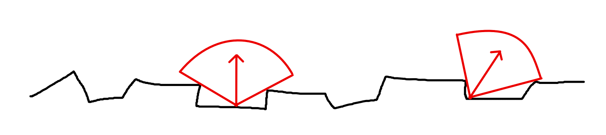
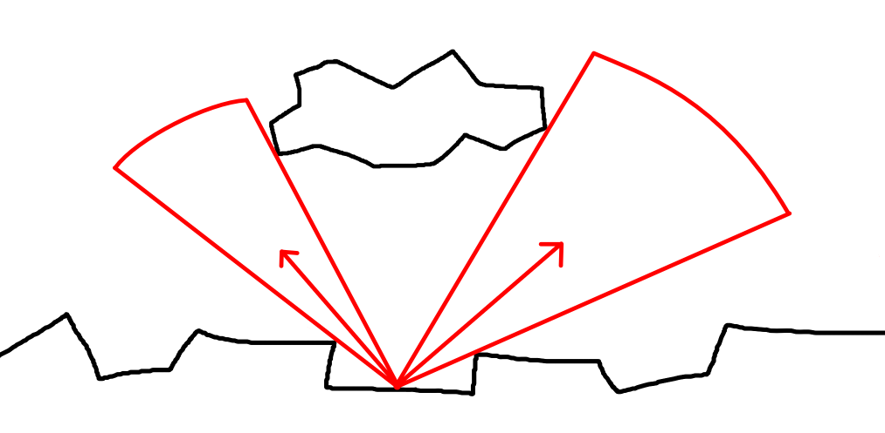
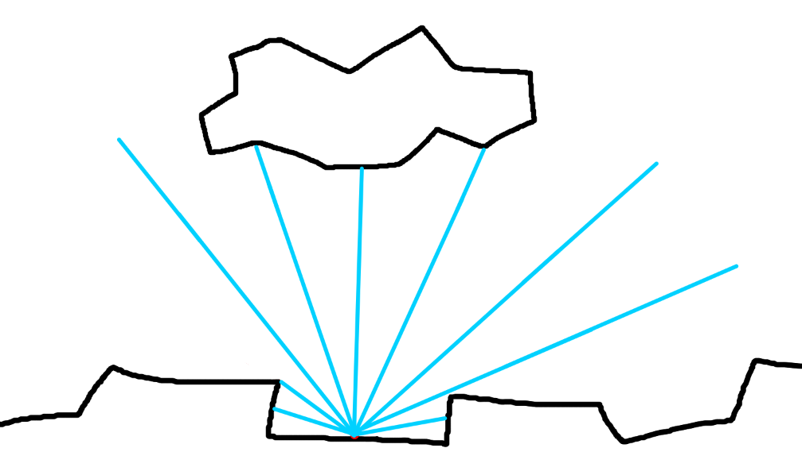
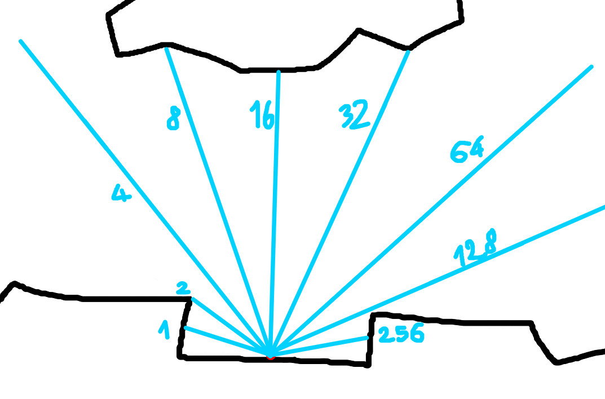

# Q3 2023, Elegy

## 29th of July 2023

I’ve been having a lot more ideas for Elegy, regarding car destruction, lightmapped day-night cycles, and I figured out how I’d approach its UI system. Neat.

## 10th of August 2023

My schedule is finally clearing up and I will be able to work on Elegy again soon.

<!-- truncate -->

## 18th of August, 2023

I have done work on Elegy. I feel GREAT.

I also realised all the AI work I’ll be doing on Cirkuz 33: Source 2 will be an amazing base to make use of when I work on Elegy Game SDK’s AI. This will be pretty epic.

## 4th of September, 2023

I’ve once again gotten overrun by the amount of work I have to do, combined with the fact I get out of bed at 13. Damn it.

## 10th of September, 2023

Lightmapped day-night cycles. Yes. I want to experiment with them. The idea at first was that I would have about 16 lightmaps for the different times of day, yeah? Well, turns out there are ways to do it a bit differently, with hard shadows involved too.

My first thought was that I could approximate it with Valve's self-shadowing bumpmaps technique. To my understanding, each pixel on an ssbump represents a visibility cone, and the magnitude of that pixel's vec3 is effectively the width of that cone. Very cool!

See the red arrows inside? Their direction is basically the RGB, and the width/narrowness of the cone is effectively `distance(rgb)`. It is calculated by shooting a bunch of rays from the pixel, and averaging out the directions of the rays that didn't hit anything.

In essence, in a normal map, a pixel says "I am facing this direction". In an ssbump map, a pixel says "this *rough* direction is where I can see light coming from." It is why they are able to achieve soft and hard shadows.

The problem is that this doesn't exactly work for non-heightmap stuff. What if there's a floating object?

Two or more cones can occur in various situations: having two or more windows in a room, garages, any place where light can directly enter/exit through two or more passages.

### An alternative approach

At the moment, this is more or less the only way I see this ever happening. Imagine a little point with 16 rays coming out of it:

This example has 9, but whatever. Now let's imagine each of these rays represents the position of a bit in a 32-bit integer.

I am convinced this could work. Each pixel would consist of an RG value, 16 bits each, making for 32 bits per pixel. Since it's sampled exclusively on a slightly reduced hemisphere (~169°), we will get a resolution of 10.5° per bit.

Parameters like these are tweakable, we could go for 64 or 128 bits per pixel if need be. At an average lightmap size of 2048x2048, uncompressed, this would result in 16 MB, 32 MB and 64 MB respectively. Could've been worse.

Unfortunately it appears this only stores direct lighting! However, it is still possible to extract directional AO and skylight contribution! They can be derived from a single pixel by averaging out e.g. 5 or 10 samples around the current bit, and adding a bit of the sunlight to that. Sky contribution would average all of the bits and add some sky colour.

Well anyway, I'll be experimenting with this in, like, October.
