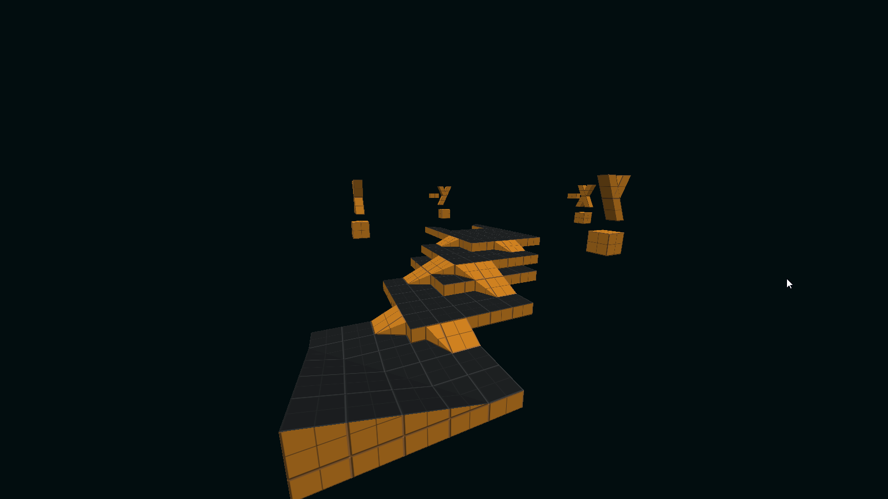
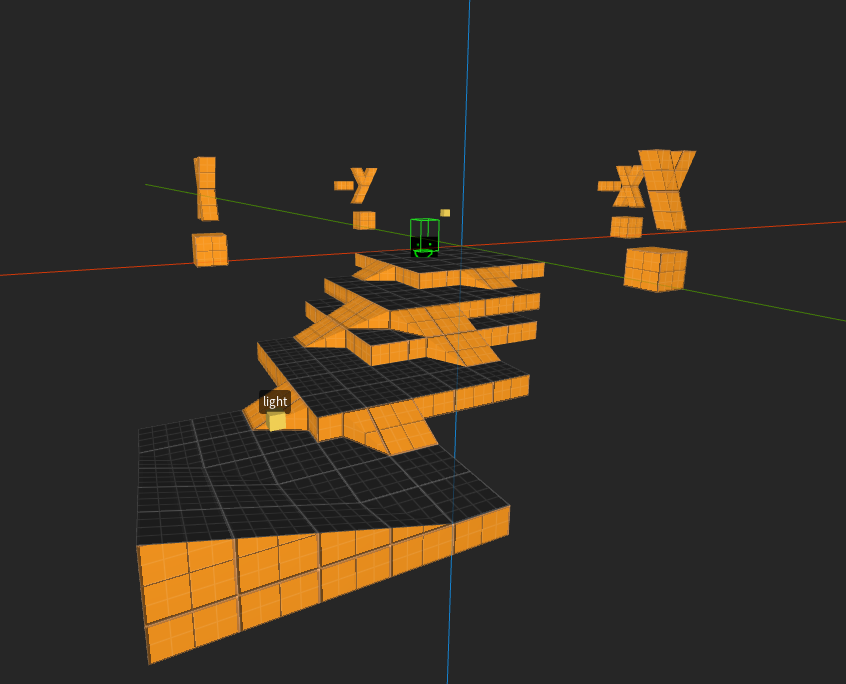
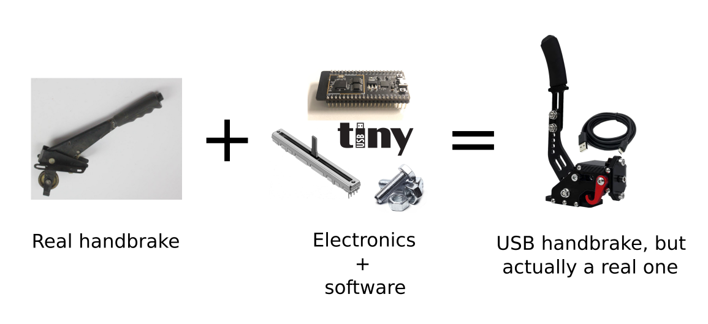

# Elegy Engine, USB handbrakes and productivity

So I finally found some time to re-enable rendering in Elegy. I also noticed I've been a bit more productive lately. Oh, and my ESP32 chips arrived!

<!-- truncate -->

## ECS-driven renderer

There will be more about this on the Elegy website, but for now I just wanna say the engine is indeed engining again:

All of the rendering code was in there, it just wasn't being utilised by any of the entity components, like `Worldspawn`. So I made it work again.

Meanwhile the same level in TrenchBroom:

This month, I hope to do some physics stuff. By the end of the year, there should be a fair amount of components for mappers.

## New video

I released [*Half-Life SDK Programming #4.3: Projectile weapons*](https://www.youtube.com/watch?v=58qpfw-sUtw) a couple weeks ago, and I feel I still have enough energy to do *#4.4* as well. Might come out by New Year's Eve, at least I really really hope so, cuz' I really wanna 1. finish the chapter, and 2. make some more stuff for the mapping series.

I managed to use my guitar a lot in the intro of this video, and I'm really satisfied with how I've progressed. I can totally do some basic things I imagine, though I'm still a long way from where I want to be.

Also, I've now taken an alternative approach to subtitles. Instead of writing them all in DaVinci Resolve, which takes 2-4 hours on average, I let YouTube autogenerate them, and then I just provide capitalisation and punctuation for the most part. It doesn't get the timing exactly how I want it, but I still have control over that. All in all, it takes me 30 minutes to do these corrections and proofread everything. Massive time saver, honestly.

## Projects

So, I've started taking my short-term todo list more seriously. The long-term todo list is gone, because it's on Trello anyway.

This I keep up to 2 weeks. Meanwhile for today specifically:

I think you get the idea.

## USB handbrake

So, my ESP32-S2 and ESP32-S3 chips arrived. I have a 1 kΩ slide potentiometre too. I figured, I could in theory make a USB gamepad out of this, where the potentiometre controls an axis value. I shoulda gone for a 10 kΩ pot, but this will work well enough.

I happen to have an old VW Passat handbrake in the garage, so I thought about doing something like this:

Should work. I'll do some additional work to secure the thing onto a platform later, so it can eventually be attached to a sim racing cockpit or a wheel stand. For January I wanna prototype the software part, i.e. getting my PC to recognise the thing as a USB device, emulate a gamepad and test it in-game. 

Before I bought anything, I did a ton of research, in particular about the ESP32's USB capabilities. Over here in Bosnia, I can only find the ESP32 and ESP8266, which are capable of low-speed USB but emulated in software. Lots of bit-banging going on.

Problem is, one of them costs like 22 KM + 10 KM of delivery. On AliExpress I got *three* different chips, a bunch of USB ports and a development adapter board, all for 50 pfennigs less. Jeez. At least now I'm comfy ordering from abroad.

But yeah, the S2 and S3's TinyUSB stack appears to be pretty good for my needs. I see it supports USB-MIDI as well, which I'm *very* tempted to utilise in building a hardware synth. Think about the possibilities, I could just write some MIDI in FL Studio or play on my Arturia keyboard, and have some circuits that respond to that and create sounds via hardware oscillators and stuff. Might write about that early next year.
