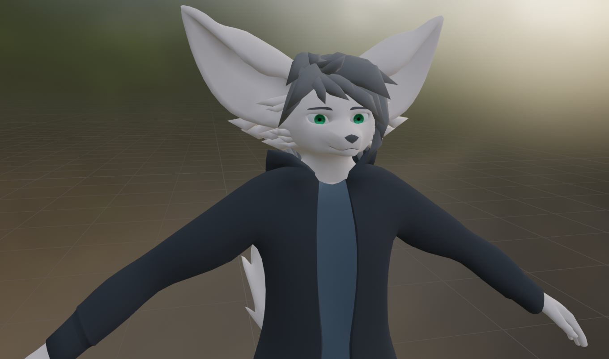
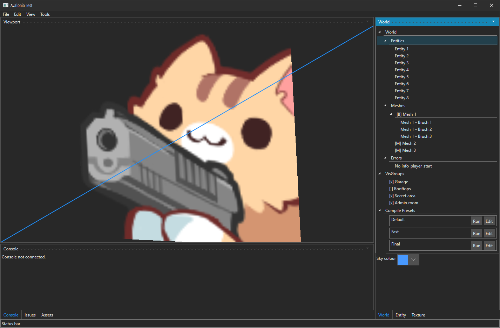
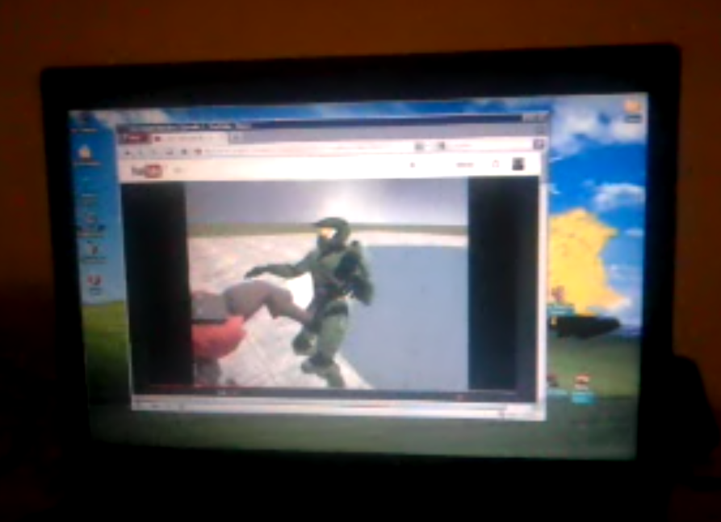
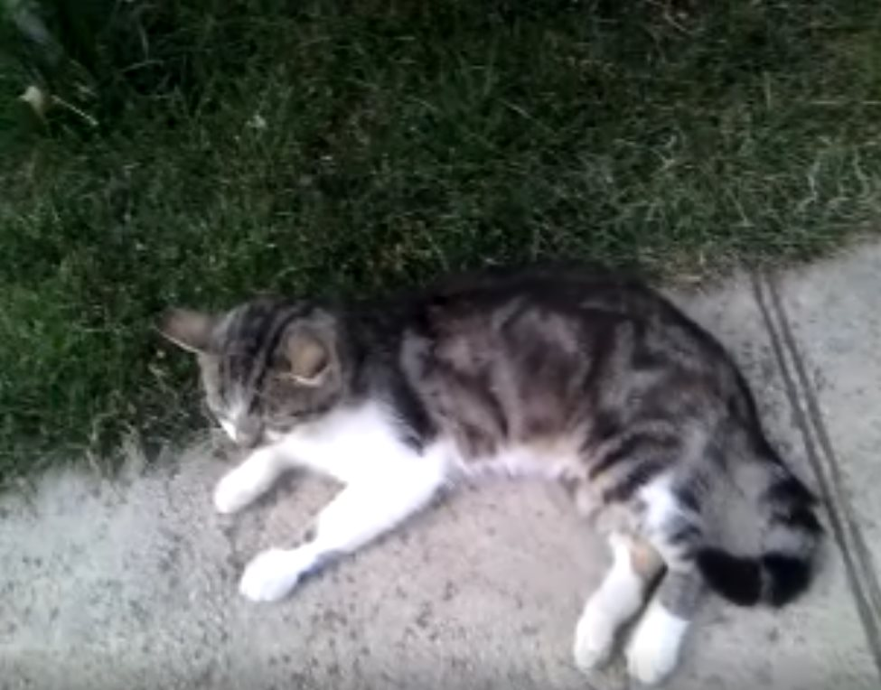
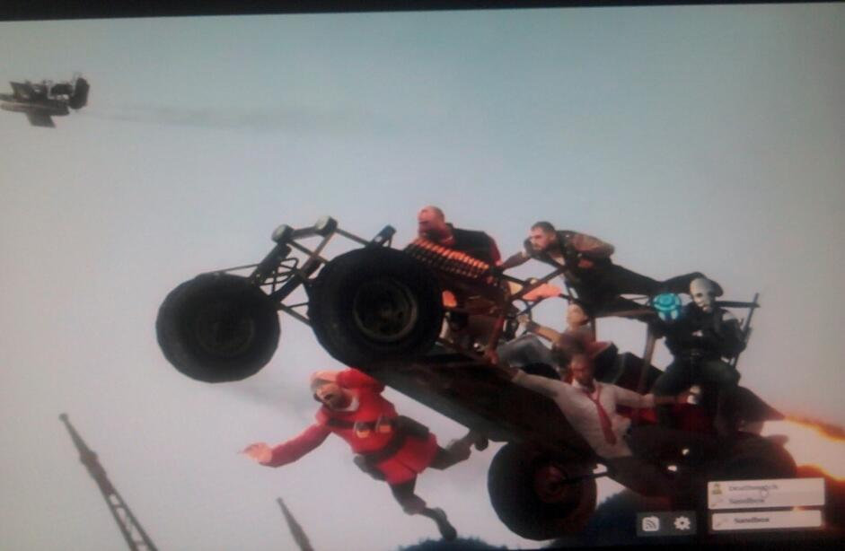

# Heartbeat - May 2025

It's been a while since the last post, but don't worry! I've been doing stuff.

<!-- truncate -->

Let's get a few quick little things out of the way:

## VRChat avatar

In February, I made a little bit of progress on my VRChat avi:

It's shaping up. I'll have to redo the hair, possibly the cheek fluffs and of course, add eyelids. But then the rest is just texturing, adding physbones and other things. Yay!

## Avalonia

I've been toying around with Avalonia more, and honestly it has so much potential. I might use it for all my desktop UI apps.

I just need to do a bit of Vulkan interop, and write some custom widgets/components. That'll be very fun, and will pave the way to a custom map editor project one day. I wanna write a colour picker and some standardised property editors (e.g. 3D vector sliders).

You might know Avalonia as this XAML-oriented UI library, but I'm actually using it in pure C#. There's a library that adds a ton of builder extension methods, so that's great. It's going to get even better with the new extension types... mm.

## Childhood

I finally got off my lazy butt and dragged that 2005 Compaq PC into my room. I pulled a bunch of files off of it and I found some old gold:

This was captured around 2015. My brother and I were watching these.

I believe this might be 2013. This is Cicko, an old cat that used to live at my grandparents'!

This one's from 2012, when I got my hands on GMod for the first time. Crazy. You know, I never thought I'd appreciate them this much. I ought to make a gallery of these at some point.

## HL SDK Programming

Honestly, I haven't done all that much lately (in general, not just the video). It feels like my brain's been on low-power mode for months. It's starting to recover though.

The latest Half-Life SDK Programming video has taken a rather long time. It may likely come out in July, and then I'm gonna be taking a break from the programming series, so I can focus on the mapping series.

After that, I need to work on the NPC chapter, and finish the series with the clientside/HUD chapter. The thing that made it take so long were viewer-submitted ideas. For the past 2 videos, I've written nearly a dozen weapon classes, I think?

It's a lot of work and there were plenty of edge cases along the way. Nothing wrong with that, but I don't feel I'm getting too much educational value out of it, it's mostly turning into a copy-paste video tutorial at that point. As such, the AI chapter likely won't have viewer-submitted ideas, since I'd love to focus more on explaining and analysing the SDK instead. Returning to form, if you will.
