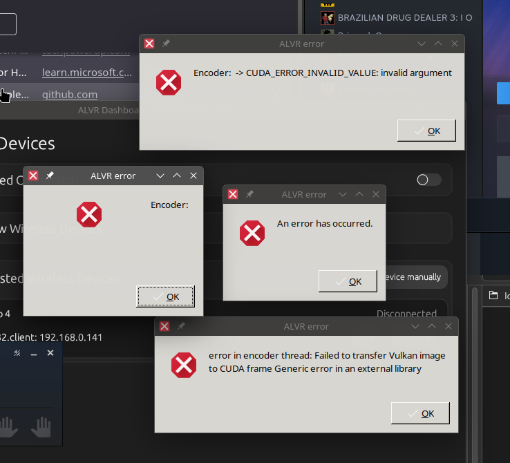
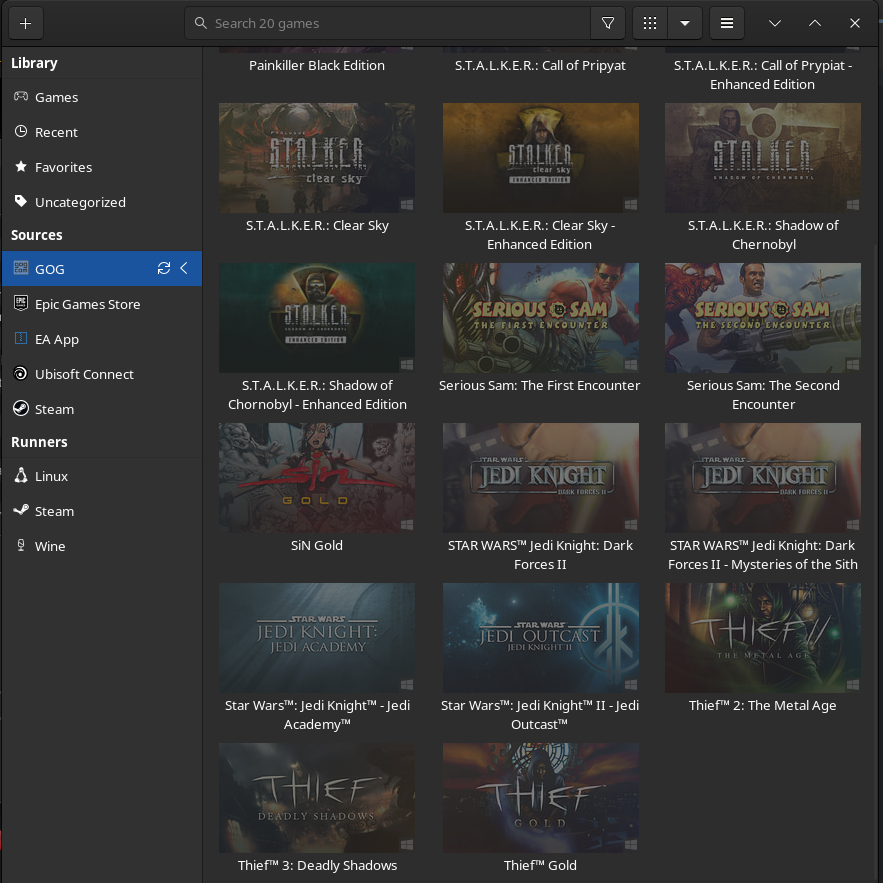
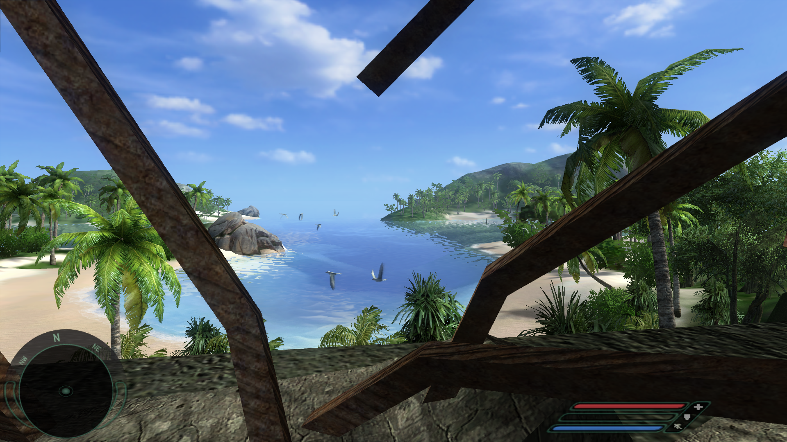
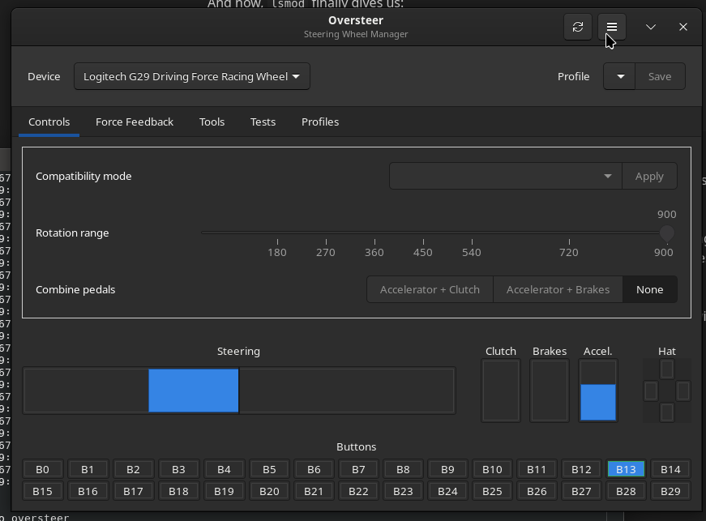

# My Linux adventure

*Note: I started writing this on the 7th of August 2025 and ended in early October.*

I got a nice little 2TB M.2 SSD some time ago, and figured I'd evaluate Linux more seriously!

<!-- truncate -->

Who is this for? Well, if you're already well familiar with nixOS, you might cringe. :)
If you're a beginner to nixOS, this will be an excellent (IMO) overview of what you could potentially go through!

I have a ton of hobbies, and being a solo gamedev, I definitely do A LOT of stuff: 3D modelling, programming, music production to name a few. I also like to do sim racing and VR, which sounds like plenty points of failure to me. I'm expecting VR and music production to be about the worst supported.

Before we start, here's my hardware:  
CPU: Intel Core i5 8400  
GPU: EVGA RTX 3060 OC (12GB)  
RAM: 32 GB DDR4 RAM (2666 MHz but runs at 1333 MHz cuz.. quad channel)  
Motherboard: Gigabyte B360 Aorus Gaming 3 Wi-Fi, firmware updated in 2021 for the RTX 3060  
Audio interface: Focusrite Scarlett 2i2 4th Gen  
Steering wheel: Logitech G29 with the shifter  

I also have a few partitions across my drives:
* Samsung 860 EVO: my `C:` drive (~250 GB, Windows 10 1909), ESP (99 MB) and recovery
* Samsung 870 EVO: my `A:` drive (~1000 GB)
* Seagate Barracuda HDD: my `D:`, `E:` and `F:` drives (~1000 GB total)

Installing the M.2 SSD was a little painful, because I had to remove my GPU and play the alignment game with the heatsink/thermal pad that came with the motherboard. It was a little difficult to screw it in, well, more specifically get the screwdriver to point at the right spot. The screw kept falling off of it. I guess I gotta magnetise it next time. But alas! It worked.

I made 2 partitions on Windows, one I mounted as my `B:` drive (600 GB for nothing but Windows games, freeing up lots of space for recordings, samples, art assets etc.), and the other one, not mounted at all.

:::info[Editor's note]
*There is also a [part 2!](10-26-linux2.md)*
:::

## Day 0 - The initial setup

7th of August, 2025.

I was initially considering EndeavourOS actually! For about a few weeks, I've been trying it out in a VM and it worked fairly well. And then a friend convinced me to try nixOS. Of course. But I mean, she knows Linux way better than me, so surely there's.. some reason why she loves it so much? We'll see if I come to regret this.

I decided to install nixOS with the KDE Plasma desktop environment and dualboot it with Windows. (nixOS 25.03, KDE Plasma 6 - Wayland, kernel 6.12)
Before going ahead, I also entered Windows' Partition Manager and made a special partition for `XBOOTLDR` in advance on my `C:` drive. I did my research and I knew a 100 MB EFI partition would not cut it. I'm quite glad `systemd-boot` has the `XBOOTLDR` extension so I don't have to resize anything. And I felt too lazy to use GRUB.

Relevant links:  
https://nixos.wiki/wiki/Dual_Booting_NixOS_and_Windows  
https://uapi-group.org/specifications/specs/boot_loader_specification/  

My fear was my USB stick (which I've had since 2012?) is no longer up to the task. Rufus, my usual tool, didn't actually produce a properly bootable USB drive. Just in case, I followed the nixOS guide which recommended an even simpler tool for the task. It had barely any options whatsoever. But it managed to boot, yay!

So, first impressions:

* GParted is really nice. I like it more than Windows's partition manager. I set up my mounts as follows:
    * `/` -> a 1.2 TB partition on the M.2 SSD (`ext4`)
        * I dedicated the rest on that SSD for Windows games, so I can relieve my other SSDs for projects etc.
    * `/efi` -> the existing 99 MB EFI partition on my Samsung 860 EVO
    * `/boot` -> a 2 GB extra bootloader partition on the 860 EVO
    * And a swap partition cuz' it don't hurt!
* There were Wi-Fi problems with WPA3 + WPA2-PSK. I couldn't use Ethernet cable cuz' my parents were sleeping (2 AM) so I did the next best thing: turn it to WPA2 Personal. Good enough for now. My brother was trying to play Roblox so he yelled at me next morning.
* I kept having random screen freezes in Firefox, sometimes lasting minutes. No idea why.

Ultimately, nixOS installed and I was able to boot into it, happy like a fool.

## Day 1 - Wi-Fi fixed, XBOOTLDR figured out

8th of August, 2025.

It would appear `configuration.nix` is located in `/etc/nixos/`. Oh. Kate comes preinstalled! It's wonderful, liking it already. I already added a few todos and apps to my system packages, anticipating I'll use them in a week or two. I only don't like that I have to type in the password every single time I save to this file, but I don't do it that often, so it's okay.

I also noticed my computer is **silent**. Like, the CPU usage is ridiculously low.

The random freezes persist. They are horrible in Firefox. I'm guessing a.t.m. that *some* sort of GPU driver is installed and it's just not co-operating with nVidia and/or Wayland, in some aspect.

I managed to set up the bootloader to use the `XBOOTLDR` partition. It was ridiculously easy:
```nix
boot.loader.efi.efiSysMountPoint = "/efi";
boot.loader.systemd-boot.xbootldrMountPoint = "/boot";
```

The screenshot utility, Spectacle, seems promising. Feels a bit like Snipping Tool. It's a bit cumbersome in the way it works, it brings up a full-on window every time I capture a screenshot. But this is Linux, I'm sure this is customisable.

Oh yeah, since I've installed the thing, Wi-Fi now works. I enabled unfree software while installing the thing, and it's got the firmware now.

Surprisingly? My Scarlett 2i2 audio interface JUST works. Out of the box. Crazy. No pops, nothing. I guess the sample buffer is big enough enough, but I'm not really noticing much of a delay? So I dunno. We'll see.

:::info[Editor's note]
*Oh we'll see about that...*
:::

*Note: So apparently, 4th gen is supported as of Linux 6.8, so it does just work, me being on 6.12:*
https://github.com/geoffreybennett/linux-fcp

## Day 2 - Video editing, and no more freezing!

9th of August, 2025.

I've installed some actual nVidia drivers. Freezing is completely gone. Damn. I have some actual HW acceleration now!
```nix
# Use open-source nVidia kernel modules, they are the best for VR
services.xserver.videoDrivers = [ "nvidia" ];
hardware.nvidia.open = true;
```
It's quite lovely.

I've installed a ton of apps: DaVinci Resolve, GIMP, Krita, Inkscape, Blender, JetBrains Rider... everything works.
```nix
environment.systemPackages = with pkgs; [
	...
	davinci-resolve
	gimp3
	krita
	inkscape
	blender
	jetbrains.rider
	...
];
```

Also installed Discord, Element, .NET 8.0, as well as KCalc, Francis and other KDE apps. Now I can finally press Fn+F3 to bring up a calculator, yay! I love that Linux distros tend to be so minimalist there's not even a calculator app. I mean some people call it bloat, but to me it's just basic-ass functionality honestly.

Now, I gave OBS Studio and Resolve a try. x264 and x265 are a no-go for me. DaVinci Resolve doesn't support them (except for the paid Studio edition). Also, no NVENC option in sight? I mean. I'm sure there's gotta be an option for that somewhere, I reckon it's a non-free plugin for OBS.

:::info[Editor's note]
*Later, as we'll find out, it is about CUDA support.*
:::

I then spent most of the day messing with KDE Plasma and playing with the effects. I love The Cube(tm) and the wobbly window effect.

## Day 3 - First gaming impressions! Assetto Corsa WINE setup, and NVENC for OBS Studio

13th of August, 2025. Was interrupted by a job interview.

I've installed Steam and Motortown: Behind the Wheel. The game works really well. Good first impressions, performance is comparable to Windows if not on par.

I also tried installing Assetto Corsa. It doesn't run out of the box, but:
    * After installing `protontricks`, I realised it needed a WINE installation.
    * After installing `wine`, I realised I needed a 64-bit-supporting WINE, so `wine-wow` it is.
    * While following Sakaki's guide on GitHub, I noticed `protonup-qt` wasn't working for whatever reason. It was stuck on extracting at 99%.
    * I switched to a CLI-based `protonup` and that just worked. After installing Proton GE 10-11, and switching to it in the game's properties, it just worked.
    * Runs even faster than I remember it?
That took me a long time. Here's the guide:  
https://github.com/sakaki91/Sakaki-AC-Linux-Guide/

In a nutshell, you're just installing .NET Framework 4.8 and Visual C++ 2015 redistributables, JUST like you would on Windows. That's kinda crazy to me.

Oh, and I've obtained NVENC for OBS Studio. Very simple:
```nix
# Enable NVENC for OBS Studio
programs.obs-studio.package = (
    pkgs.obs-studio.override {
        cudaSupport = true;
    }
);
```
Unfortunately, DaVinci Resolve won't open NVENC'ed recordings. I gotta write a script so `ffmpeg` mass-converts them to AV1 sometime.

I also separated my configs for some modularity:
```nix
# Pre-configuration
imports = [
	./hardware-configuration.nix # Do not touch
	./hardware-specific-patches.nix # nVidia patches, dualboot options...
	./language-and-input.nix # Bosna broj 1!!!
];
```

## Day 4 - A bit more gaming

14th of August, 2025.

Half-Life just works. A native wonder. Also downloaded Bonelab, Tactical Assault VR and BeamNG.drive. BeamNG.drive (Proton Experimental + Vulkan renderer) works near perfectly and feels smoother than on Windows.

Installed SteamVR, OpenComposite, `wlxoverlay-s`, as well as enabling WiVRn and ALVR.

```nix
programs.alvr.enable = true;
# NOTE: For ALVR, must add SteamVR launch argument:
# ~/.local/share/Steam/steamapps/common/SteamVR/bin/vrmonitor.sh %command%

services.wivrn.enable = true;
services.wivrn.openFirewall = true;
services.wivrn.config.enable = true;
# NOTE: For WiVRn, must add, per-game, launch argument:
# PRESSURE_VESSEL_FILESYSTEMS_RW=$XDG_RUNTIME_DIR/wivrn/comp_ipc %command%
```

Tried installing `trickle` to limit bandwidth, but it doesn't seem to compile as it "couldn't access libc". Oof. Also installed Obsidian and I just kinda manually copied my vault over from Windows. I'm very much the manual labourer type. In fact, this is where I am writing *this* very journal, until I port it to a website.

It would appear there's occasional clicks and pops when playing back audio in Discord. Speaking of audio, I've finally remembered to install `qpwgraph`, but I haven't tested it yet.

## Day 5 - Enable CUDA, folks

15th of August, 2025.

Installed Abiotic Factor. Runs really well! It has the same average framerate as on Windows, but it just feels a lot smoother? Damn.

Found some alternatives to HWInfo, MSI Afterburner and RivaTuner, namely `lm-sensors`, `conky`, and MangoHUD. There's more to it than that though, but it's gonna be an okay place to start. I haven't installed them yet though.

Set up ALVR. As usual, I had to manually enter my Pico. Blank screen in SteamVR though.

Added `~/.local/share/Steam/steamapps/common/SteamVR/bin/vrmonitor.sh %command%` to SteamVR's launch settings. That made it stop popping up asking for superuser permissions. Still blank screen.

I then also remembered to add `programs.alvr.openFirewall` to the config.

Well at least it's something. It appears to me to be an encoder error of some sort.



It appears to not be an encoder error. It just can't. I suspect it might be a Wayland multiview issue on nVidia drivers. I googled "CUDA nixOS" and found an interesting config setting: `nixpkgs.config.cudaSupport`. Setting it to `true` understandably recompiles a lot of packages (rebuilding Krita, GIMP, Blender, OBS, WiVRn...), so I'll try to play some Abiotic in the meantime.

Read more: https://nixos.wiki/wiki/CUDA

This gives me the NVENC plugin in OBS by consequence. So I don't need to explicitly enable `cudaSupport` for it any more.

I also found out via `lsmod` that the `universal-pidff` (FFB kernel module for Logitech, Moza etc.) is not actually installed. That's because I initially added it as a system package, instead of the proper way:
```nix
# Kernel
boot.extraModulePackages = with config.boot.kernelPackages; [
	# Universal FFB driver for steering wheels
	universal-pidff
];
```
My line of thinking is I might also upgrade from Linux 6.12 to 6.15, at some point. December 2026 is the end date for 6.12 AFAIK, and t.b.h. I kind of wanna see what would change there.

(the kernel module still doesn't show up, oh well, I'll have to plug in my Logitech G29 eventually)

:::info[Editor's note]
*Little did I know, this is actually not for Logitech wheels. Teehee.*
:::

Oh God. It's compiling the nVidia drivers and Blender and everything. Yup. Shoulda globally enabled CUDA for everything from the start. Anyway I took the opportunity to also download HL2VR, The Long Drive and a few others.

It's close to 8 in the morning. This thing has finally finished rebuilding everything. My poor CPU had its own Herzegovina experience.

:::info[Editor's note]
*Meaning, scorching heat. Doesn't help it was August either.*
:::

## Day 6 - Initial VR impressions

16th of August, 2025.

Ran garbage collection for the first time. 18 generations in, I think. 25 GB cleaned!

WiVRn has been extremely pleasant to set up. Definitely beats ALVR in terms of functionality (that is to say, an 8 vs. a 0), though on my Pico 4 it is a little hard to see the pairing PIN. It's a one-time process though.

I adore the video encoder setup page, the way you can partition the screen is just brilliant. There's a little screen when you open the app in VR, and you can configure your resolution etc. I like that choice quite a bit. I just wish there was a little place to check the version at.

However, I am noticing poorer performance OOTB compared to ALVR on Windows in Bonelab, but that is running on Proton Experimental. I gotta see if using a different Proton will help. I also gotta try a different version of the nVidia drivers.

I'm too lazy to build the 580 driver tonight, so I'm grabbing the 575 driver, a possible upgrade to the 570 one I have now.

Interesting. I get much more options in the nVidia Settings app.

H3VR is barely playable, it feels like it's running at 20-30 fps. Proton GE makes it more bearable. Bonelab with Proton GE is much better, it seems to be around 55 fps now. BeamNG doesn't work with WiVRn, nor does HL2VR.

HUGE breakthrough: I got ALVR to work by unpacking the `.tar.gz` (20.13, to match my headset's) from GitHub releases, and using `steam-run` on it. Remarkable. SteamVR's environment is suuuuuuuper silky smooth, and HL2VR even more so. I am impressed. Even the Wi-Fi was super stable, props to my router. I need to test more games tomorrow, this may be my daily driver for VR.

Read more: https://github.com/alvr-org/ALVR/issues/2792

The person is using:
```bash
nix-shell -p steam-run --run "steam-run ./alvr_dashboard"
```
However that's not necessary if Steam is already enabled, I think. It already gives you `steam-run` as an executable so you can just use that directly.

:::info[Editor's note]
*Yes. Just run this command:*
```bash
steam-run ./alvr_dashboard
```
*Or whatever the path to the executable is.*
:::

## Day 7 - Audio fixin' time

17th of August, 2025.

After talking to a friend, it seems it's less WiVRn's fault that it performs poorly in H3VR, more precisely OpenComposite. I gotta try xrizer at some point.

After configuring PipeWire a lot, I couldn't get it to work well on Discord. It's almost like the "pipe" was "clogged" whenever I was in voice chat with people w.r.t. my microphone. So I switched to PulseAudio and it works flawlessly. I'll miss `qpwgraph` and Sonusmix.

Oh no, ALVR needs PipeWire! I guess I really need to make PipeWire work. I could try out an alternative Discord client for once I guess.

I spent all day configuring PipeWire, WirePlumber, PipeWire-Pulse, Discord's RTC is still messing with my audio. I really do wonder what PulseAudio does differently here.

I've tried setting all kinds of settings in them:
```nix
  # Low-latency profile (192 samples at 48 kHz)
  services.pipewire.extraConfig.pipewire."92-low-latency" = {
    "context.properties" = {
      "default.clock.rate" = 48000;
      # We can go very fast :)
      "default.clock.allowed-rates" = [ 44100 48000 82000 96000 ];
      "default.clock.quantum" = 192;
      "default.clock.min-quantum" = 64;
      "default.clock.max-quantum" = 1024;
    };
  };
```
TL;DR 192 samples at 48 kHz. 128 has popping, which makes sense, my CPU is just getting old at this point. I have learned quite a bit. Apparently you can access information about your audio devices literally from within the filesystem:
```bash
[admer456@nixos:/proc/asound]$ ls card2  
id  pcm0c  pcm0p  stream0  usbbus  usbid  usbmixer

[admer456@nixos:/proc/asound]$ cat card2/stream0  
Focusrite Scarlett 2i2 4th Gen at usb-0000:00:14.0-6, high speed : USB Audio  
  
Playback:  
 Status: Running  
   Interface = 1  
   Altset = 1  
   Packet Size = 72  
   Momentary freq = 48000 Hz (0x6.0000)  
 Interface 1  
   Altset 1  
   Format: S32_LE  
   Channels: 2  
   Endpoint: 0x01 (1 OUT) (SYNC)  
   Rates: 44100, 48000, 88200, 96000, 176400, 192000  
   Data packet interval: 125 us  
   Bits: 24  
   Channel map: FL FR
```

While I still have some time, I figured I'd test Bonelab really quickly in ALVR, but oof. Bonelab's OpenXR loader is saying stuff. I guess that's because SteamVR isn't set as the default runtime. I don't have time for this, I just wanna sleep.

## Day 8 - VR troubles, and a triumph

18th of August, 2025.

I tried using the `nixpkgs-xr` overlay, but it keeps getting stuck when "waiting for a lock" on `openxrs` of some sorts.. I decided to grab a newer ALVR just to see if that might fix it, version 20.14 instead of 20.13 which I have on my headset (and is in `nixpkgs`). Nope.

No matter what I do, I cannot set SteamVR as the default OpenXR runtime. I've set the `XR_RUNTIME_JSON` environment path, I've tried doing it through SteamVR, but it just errors out, something along the lines of `Could not read file 'vrmonitor://openxr/makedefault'`. This sucks. SteamVR keeps reporting "another copy" of the SteamVR runtime but that's just not good enough for Bonelab.

Digging through various Steam config files, however, I found something about dismissed popups in `openvr.settings`. I do remember SteamVR initially asked me about it, when I was initially setting up WiVRn and just barely touching ALVR to see if I can get SteamVR to run (when it used to fail with the CUDA error stuff). I just dismissed it. So I removed that popup dismiss entry, and indeed it reappeared. This time, I didn't dismiss it and I made it the default runtime. Lo and behold, it actually worked!

Here's what that may have looked like:
```json
   "dashboard" : {
	   // stuff
   },
   "dismissedPopupMenus" : { // Admer: This, right here!
	   "POPUPMENU_SetDefaultXrRuntimePopup" : true
   },
   "notifications" : {
	   // stuff
   },
```
I don't remember the exact names, but should that ever happen to you, you know what to look for!

(Note: Some people had a bug where *that* button in particular didn't work and the solution was to create an `active_runtime.json` for the OpenXR loader. I was having the literal opposite issue, where `active_runtime.json` didn't fix it and the only thing that worked was setting it through that popup. Mm. Imagine relying on a one-time popup.)

I tested H3VR as well as Bonelab for some time on an Ethernet cable and it's *ridiculously* smooth. I don't think I've ever hit sub 85 fps. My headset is charging now, so I'm gonna go over my remaining tasks real quick:
* Configure the PipeWire stack further and figure out what's wrong with Discord VC
* Test the Logitech G29 in the driving games and in VR too
* Test VRChat, Far Cry 1 VR, Half-Life Alyx and more
* Configure GoG games (I wanna play OG STALKER, Jedi Knight Dark Forces 2 and Jedi Outcast..)
* Test `wlxoverlay` or `wlxoverlay-s`
* Music production!!

Some of these I will cover tonight, we'll see.

So, according to the Arch Wiki, `api.alsa.period-size` should be doubled until problems go away. Let's try just that...
```nix
  # Configure Scarlett 2i2 general settings
services.pipewire.wireplumber.extraConfig."10-scarlett-io" = {
	"monitor.alsa.rules" = [ {
		matches = [
			{ "node.name" = "~alsa_output.usb-Focusrite*"; }
			{ "node.name" = "~alsa_input.usb-Focusrite*"; }
		];

		actions = {
			update-props = {
				# audio.format
				# audio.rate
				# audio.channels
				"audio.rate" = 48000;
				"api.alsa.period-size" = 128;
				"session.suspend-timeout-seconds" = 0;
			};
		};
	} ];
};
```
Of course, I won't be doing this a billion times within `configuration.nix`. I have a temporary `wireplumber` config to test this stuff!
```nix
monitor.alsa.rules = [
    {
        matches = [
            { node.name = "~alsa_output.usb-Focusrite*" }
            { node.name = "~alsa_input.usb-Focusrite*" }
        ]
        actions = {
            update-props = {
                api.alsa.period-size = 128
                api.alsa.start-delay = 8192
                api.alsa.headroom = 8192
            }
        }
    }
]
```
Oh yeah. So let's see how this goes.

Okay. Surprisingly it just works. `period-size`, `start-delay` and `headroom` is where the answer's at. Without `start-delay` I have to restart the wireplumber service once before joining a call. I was able to hear myself clearly enough in Abiotic Factor and my friends on Discord could hear me just fine too, without stuttering. The Discord microphone problem is solved!

I also tested ALVR's microphone stuff and it works just fine on Discord. VR just works with Assetto Corsa, but I haven't been able to get it in BeamNG. It seems there was once a patch for Proton GE to let BeamNG get the right Vulkan extensions. Not any more...

https://github.com/GloriousEggroll/proton-ge-custom/commit/3a0fe5130157cc18c58b92c703f574d970543b6a

:::info[Editor's note]
*Okay so, there's a native version of BeamNG.drive for Linux. That one should just work, no need to run the Windows version thru Proton.*
:::

## Day 9 - Audio problems persist, but progress is made. Initial DAW testing

19th of August, 2025.

Looks like my microphone is robotic until I restart `wireplumber-service`. This is manageable, I could write a small script to do this on startup.

I've just set up some Firefox extensions I use. Very nice. These aren't easy to configure through Nix, but that's fine by me.

I tried Tactical Assault VR and it runs alright. VRChat also just works. It runs at a lower framerate than on Windows (60fps where I would have 72), but it's far more consistent, and it just feels like more as such. I am quite excited.

I've been looking at DAWs and honestly I think I might give Ardour a shot, and of course install `yabridge`.

Okay, so Ardour connects to ALSA, JACK/PipeWire and PulseAudio. The latter doesn't appear to have any MIDI support? But it's probably just PipeWire-Pulse not having that. In either case, I cannot switch away from PipeWire, I need it for VR.

The latency is awful out of the bat. I then started looking for Ardour low-latency setup guides, and also googling "nixOS Ardour". I found nixOS' wiki page on audio production and thus I found Musnix! After cloning it to my `/etc` directory and setting it up easily in `configuration.nix`:
```nix
{
	imports = [
		...
		<musnix>
	];
	...
	musnix.enable = true;
	users.users.<youknowwho>.extraGroups = [ ... "audio" ];
}
```

Relevant links:
https://wiki.nixos.org/wiki/Audio_production
https://github.com/musnix/musnix

It helped reduce CPU usage by a ton. Essentially it enables a "real-time priority" mode for the user. DAWs heavily benefit from it, since the operating system essentially goes "okay, you're important, so I'm giving you more CPU time whenever you need".

What was left to do was to tweak WirePlumber further:
```nix
  # Low-latency profile (64 samples at 48 kHz)
  services.pipewire.extraConfig.pipewire."92-low-latency" = {
    "context.properties" = {
      "default.clock.rate" = 48000;
      # We can go very fast :)
      "default.clock.allowed-rates" = [ 44100 48000 82000 96000 ];
      "default.clock.quantum" = 64;
      "default.clock.min-quantum" = 32;
      "default.clock.max-quantum" = 8192;
      "clock.power-of-two-quantum" = true;
    };
  };
```
The quantum is now 64 by default, JACK applications assume a max of 8192 so I also set that there just to be safe. I enabled `clock.power-of-two-quantum`, no idea if it's on by default, but in either case, it should let my CPU utilise SIMD to process audio faster. Next up:
```nix
  # Medium-latency profile for PulseAudio server and Discord (256 samples at 48 kHz)
  services.pipewire.extraConfig.pipewire-pulse."92-low-latency" = {
    "context.properties" = [
      {
        name = "libpipewire-module-protocol pulse";
        args = {};
      }
    ];
    "pulse.properties" = {
      "pulse.min.req" = "128/48000";
      "pulse.default.req" = "256/48000";
      "pulse.max.req" = "8192/48000";
      "pulse.min.quantum" = "128/48000";
      "pulse.max.quantum" = "8192/48000";
    };
    "stream.properties" = {
      "node.latency" = "512/48000";
      "resample.disable" = true;
    };
  };
```
Some games may use this, as well as Discord. I really don't need low latency here. The default req is 256 now.
```nix
  # TODO: Rename and merge
  # More low-latency stuff, ignore the name
  services.pipewire.wireplumber.extraConfig."10-discord-fix" = {
    "monitor.alsa.rules" = [ {
      matches = [
        { "node.name" = "~alsa_output.usb-Focusrite*"; }
        { "node.name" = "~alsa_input.usb-Focusrite*"; }
      ];

      actions = {
        update-props = {
          # If trouble persists, double this
          "api.alsa.period-size" = 128;
          "api.alsa.start-delay" = 1024;
          "api.alsa.headroom" = 2048;
        };
      };
    } ];
  };
```
Here you may notice I decreased the start delay (which I don't think ever did much??) and headroom.

I have noticed that `api.alsa.period-size` directly impacts Ardour's default buffer size. Ardour *can* change the buffer size at runtime, but that appears to break everything for me. My MIDI keyboard, inputs etc. Right now though, the buffer size/latency is fine, I can work with it.

I tried installing Guitarix as a VST3 and it cannot load `libfreetype.so.6`. Mmm. I found a list of packages for `nix-ld` but they don't help here. Apparently the VST3 version of Guitarix uses JUCE, soooo I reckon if I install JUCE in there, it might work? Let's try tomorrow.

:::info[Editor's note]
*Later I learned about shells and FHS environments, which are super simple to set up. More on that in the next blog...*
:::

## Day 10 - MIDI keyboard causes low resolution, Ardour troubles, VST success

20th of August, 2025.

So I left my MIDI keyboard plugged in, and apparently it somehow caused my nVidia display driver to not get loaded. I was surprised why my screen was so low-res all of a sudden. Oh well, I guess that's just a thing now.

Okay so the JUCE thing didn't work out. It would appear Linux has its own plugin format, LV2? I'm also seeing CLAP mentioned. Oooh okay. LV2 is LADSPA v2, and LADSPA is Linux Audio Developer's Simple Plugin API. CLAP is Clever Audio Plugins API. Okay, very nice. In either case, the packages I put in `nix-ld` don't apply to packaged programs like Ardour in my case. It only works for unpackaged, unpatched ones.

I am slowly learning Ardour, figured out how to work with notes and regions (what I call patterns coming from FL Studio). I'm already getting used to this, it ain't half bad. Now I just gotta try out `yabridge` and see if it'll work with MONSTER Synth, DR-84 and a few others. I gotta see if my paid VSTs will work too.

Well, the Linux version of Tyrell was missing some .so files. So I decided to set up `yabridge` and get the Windows .vst for it. Would you look at that, it worked! I also tried out some LSP filter plugins, pretty nice stuff.

Relevant links:  
https://search.nixos.org/packages?channel=25.05&show=lsp-plugins&query=lsp  
https://lsp-plug.in/  

I managed to install Korg Triton, MONSTER Synth (seems to be gone from the Internet?), and DR-84. I got a few more to install, but honestly I'm super happy.

## Day 11 - Audio is fixed FOR GOOD

21st of August, 2025.

Man, Ardour is such a lost cause on my end. Several xruns per minute, and nearly every session has had a devastating freeze so far, either in the plugin selector, individual plugins' UIs or the audio settings. I also made a little config for PipeWire's JACK emulation:
```nix
jack.properties = {
    rt.prio = 99
    node.latency = 512/48000
}
```
Surprisingly, 512 sounds really good to me, like, I don't even notice a delay. The DAW might be doing something w.r.t. monitoring the inputs, but I don't know.

I made one huge step forward in reducing pops and cracks and that's setting the audio format from F32LE to S24_3LE, as that is native to my audio interface, avoiding resampling. It's much better now, but Ardour still crashes if you look at it the wrong way.

Also here's some links because I forgot:  
https://github.com/scottericpetersen/pro-audio-on-linux - Theory on Linux audio **(important)**  
https://pipewire.pages.freedesktop.org/wireplumber/daemon/configuration/alsa.html - More info on ALSA properties in WirePlumber **(important)**  
https://www.reddit.com/r/pipewire/comments/128ikt8/pipewire_configuration_sample_rate_bit_depth_and/ - 24-bit formats **(important)**  
https://wiki.archlinux.org/title/Professional_audio - Arch Wiki on professional audio, mentions realtime kernels and many PipeWire fixes incl. `period.size` and such **(important)**  
https://linuxmusicians.com/viewtopic.php?t=27121 - Fedora professional audio, it's good to see how others do it, but you don't have to really read this one  
https://interfacinglinux.com/linux-compatible-audio-interfaces/ - Linux-compatible interfaces if YOU are looking to buy one!  
https://docs.pipewire.org/page_man_pipewire-client_conf_5.html#client_conf__stream_properties - PipeWire's JACK client configuration  
https://docs.pipewire.org/page_man_pipewire-jack_conf_5.html - Similar to above  
https://gitlab.freedesktop.org/pipewire/pipewire/-/wikis/Config-PipeWire?_sm_au_=iVVFVQNqpW06rVfjTvBpFLHLqs6cW - MORE PipeWire configuration  
https://manual.ardour.org/synchronization/latency-and-latency-compensation/ - Some more information from the Ardour manual  
https://www.nicolairuckel.com/posts/focusrite-pipewire/ - How to separate input 1 and 2 as mono devices (I didn't use this, but I did find it along the way, it's nice to have)  
https://sevish.com/2019/how-to-make-microtonal-music-on-linux/ - Microtonal music on Linux, mentions some cool plugins and insights into a few DAWs (e.g. Bitwig not supporting LV2 and a workaround for that)  

## Day 12 - Reaper and "real world" gaming

22nd of August, 2025.

Welp, I caved in. I downloaded Reaper. And WOW, all my issues are just completely gone. I only had to add extra paths to load my packaged LV2 plugins:
```
~/.nix-profile/lib/lv2
/etc/profiles/per-user/admer456/lib/lv2
/run/current-system/sw/lib/lv2
```
I obtained these by running `echo $LV2_PATH`, and you may similarly do `echo $VST3_PATH`. Adding the last one made it load the packaged LV2s for Guitarix. Awesome. I think I'm staying with Reaper, I don't even need FL Studio any more.

I played Abiotic Factor with my friends tonight and shared my screen on Discord. Not bad! At some point I'll try out the G29 and `wlx-overlay` stuff.

## Day 13 - Oops, ALVR firewall rules accidentally disabled

23rd of August, 2025.

I hanged out in VRChat today. But only after I manually opened ports required by ALVR:
```nix
networking.firewall = {
	allowedTCPPorts = [ 9943 9944 ];
	allowedUDPPorts = [ 9943 9944 ];
};
```
How did I find that out? Well, by now I've developed a habit of actually looking into the Nix packages themselves, or in this case the option:  
https://github.com/NixOS/nixpkgs/blob/nixos-25.05/nixos/modules/programs/alvr.nix  
```nix
config = lib.mkIf cfg.enable {
	environment.systemPackages = [ cfg.package ];

	networking.firewall = lib.mkIf cfg.openFirewall {
		allowedTCPPorts = [
			9943
			9944
		];
		allowedUDPPorts = [
			9943
			9944
		];
	};
};
```
TL;DR:
* If the package is enabled:
* Open a buncha ports in the firewall

On this occasion I also learned that, if you set `systemPackages` in multiple places, they don't get overridden, they get merged:  
https://discourse.nixos.org/t/append-to-a-list-in-multiple-imports-in-configuration-nix/4364

So, yeah. I had disabled ALVR previously, which disabled the firewall rules too. I quite like this declarative pattern. Anyway, time to sleep once again.

## Day 14 - Good ol' games

25th of August, 2025.

After a few days, HL Alyx finally installed, yippee!

A'ight, I wanna set up GoG games today. I found this:  
https://www.reddit.com/r/gog/comments/vp8ukw/comment/ieku9bm/  
Now, because some people are deleting their posts due to Reddit doing some bad things, I'll write a summary here:

Easy way: Heroic Games Launcher (or Lutris from my research).  
Specific to nixOS:  
https://wiki.nixos.org/wiki/Heroic_Games_Launcher  
https://nixos.wiki/wiki/Lutris  

More laborious way:
1. Add the game's setup EXE as a non-Steam game, in Steam.
2. Install, i.e. launch it, and pay attention to dependencies like DirectX stuff, redistributables etc.
3. Once installed, open the properties for the non-Steam game and set these two:
	1. Target: `/games/Example/Example.exe`
	2. Start: `/games/Example`
4. Depending on the game, you may need to install additional dependencies via either `winetricks` or `protontricks`, like .NET Framework, Visual C++ redistributables, DirectX stuff, DXVK and so on.

I'm not sure why they are doing it this way in the first few steps, but I do suppose Steam ultimately acts as a Proton launcher.

Lutris has its own runtime and some potential incompatibilities due to Steam's runtimes. I'm not sure if this is reported just because Lutris gets used way more, or because Heroic is just less intrusive (a plain launcher). Heroic is also a "web" app... why. So, I'll try Lutris I suppose, let's see how that works out.

  
Lovely. It integrates with GoG, so that's a nice start.

  
Well, that works. :)

## Day 15 - Tying some goose ends

26th of August, 2025.

So, plugging in the steering wheel just works. Except only the on-wheel buttons work, not much else. No steering, no pedals, no shifting, none of the axes. Apparently I made a little oversight:
1) I used the wrong driver (`universal-pidff` instead of `new-lg4ff`), and
2) I needed to include it in `boot.kernelModules` to load automatically!

So I went from this:
```nix
boot.extraModulePackages = with config.boot.kernelPackages; [
	universal-pidff
];
```
To this:
```nix
boot.extraModulePackages = with config.boot.kernelPackages; [
	new-lg4ff
];

boot.kernelModules = [
	# new-lg4ff, the package, actually installs
	# a hid_logitech_new, the kernel module
	"hid_logitech_new"
];
```
And now, `lsmod` finally gives us:
```bash
[admer456@nixos:~]$ lsmod | grep logitech  
hid_logitech_new       81920  0  
ff_memless             20480  1 hid_logitech_new  
usbhid                 90112  1 hid_logitech_new  
hid                   274432  3 usbhid,hid_generic,hid_logitech_new
```
Awesome. :)

Oh, apparently it's covered by `hardware.new-lg4ff.enable` instead. LOL. I also installed the `linuxConsoleTools` package and `oversteer`.

Okay, so Oversteer isn't detecting the wheel, and `jstest` isn't reporting any changes in any of the axes, just buttons. Weird. The wheel has the centering spring engaged, it resists being turned, which on Windows typically meant that G-HUB wasn't running.

Oh, apparently I just had to switch it from PS4 mode to PS3. It was a teeny tiny switch on the top, I honestly completely forgot about that thing.



I've tested it in Assetto Corsa and it works really well. Perhaps the FFB is a bit too strong, but I can just tweak that, it's not an issue.

Relevant links:  
https://wiki.archlinux.org/title/Logitech_Racing_Wheel  
https://github.com/berarma/oversteer  
https://github.com/berarma/new-lg4ff  
https://nixos.wiki/wiki/Linux_kernel#Out-of-tree_kernel_modules  
https://github.com/JacKeTUs/linux-steering-wheels  

If you're using Moza:  
https://github.com/JacKeTUs/universal-pidff  
https://github.com/Lawstorant/boxflat  

I also tried `wlx-overlay-s`, had to run it with `steam-run` because that's also the environment SteamVR runs in!

For the very basic task of displaying my desktop and using a keyboard, it works just fine. It looks like it can be configured through some JSONs in `~/.config/wlx`. No GUI? No problem for me, though it would be nice compared to XSOverlay and others. I may also try WayVR-Dashboard.

Oh yeah, Half-Life Alyx works also.

## Conclusion

I think this is about it. I've done nearly everything I wanted to test here. I'll still be using Windows to finish some remaining work on a couple existing projects, but after that I'm basically migrating entirely to Linux. There is really no excuse for me any more. 2025 is, indeed, my year of the Linux desktop.

Some of the software lacks a little polish, but I'm willing to contribute where I can. I've quickly found replacements for some things like FL Studio, and in nearly all games I'm seeing much smoother performance at equivalent or, sometimes, even better framerates.

Certain things like programming, 2D and 3D art I've already done previously on my Linux Mint laptop(s). I just know they work. What I was really curious about was the other stuff: VR, sim racing, music production, and the overall desktop experience.

So, I'm delighted to say I won't need to taint my next PC with Windows. I grew up on Windows XP and later 7. When I had to use 10, I just had a feeling I would want to move away from it later. My Linux transition was a multi-year project, involving lots of occasional research and switching software.

I went from Sony Vegas to DaVinci Resolve, 3DS Max to Blender, Paint.NET to GIMP, and I leaned towards open-source. Not just because one day I thought about switching to Linux, but also purely out of principle. As small as it is, I've contributed to TrenchBroom. A level editor I actually use in my day-to-day.

I've always viewed Linux as a lovely philosophy, one about enjoying freedom and contributing back. But I also still enjoy non-free software, simply because of the level of quality. It's a risk, it requires trust, and that's okay. Steam, Reaper, GitKraken, JetBrains IDEs, all that stuff is proprietary, but 1) if need be, I can always switch, I've done it before, 2) the level of stability, ergonomics and overall value justifies it for me. Well. SteamVR isn't exactly ergonomic, but you do get the idea for the others.

When I saw all the AI stuff being crammed into 11, I thought to myself "nope, never installing that". I know there are efforts like Tiny11, but why spend so much effort removing bad stuff, when you could start with something small and add the good stuff you want to it?

That's been my nixOS experience so far and it feels good to be finally, properly free. Thanks for reading. I'll be daily-driving this distro for a little while and probably write some actual guides.
