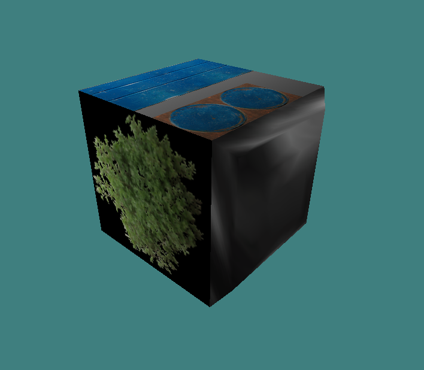
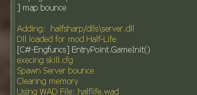

# Porting Half-Life to C#, gltf2mdl progress, and other things

I have a reason to believe this year marks the return of old me. I'll explain what that means soon.

I started porting Half-Life SDK over to C#, basically aiming to have all the game code there, and only the utmost minimal C++ boilerplate to let the engine launch the mod & then delegate all logic to a C# DLL. But first, some in-the-meantime stuff.

<!-- truncate -->

## Things

So, I got an air fryer. It's possibly one of the greatest investments I've made so far. It can cook sausages while making basically no mess. Whenever I try frying these in a pan, the oil just goes everywhere cuz' I just don't feel like putting that much oil inside. Not really a deep frying person. So this is perfect for me.

## Art

When I was a kid, I used to draw a bit. I wasn't good at it, but I sure liked to doodle the occasional thing. Then, I finished primary school, started high school, and fast-forward I haven't drawn in close to a decade! Man...

But, some time ago I had a dream and I decided "screw it, I'm gonna draw this". I installed Krita and started messing around. I had this weird feeling, like I was avenging my younger self? Soon enough I got this:


The road & house were just quickly tacked on and I kinda left them as-is. But yeah.

Some time later, I wanted to experiment with some other brushes, so I just went at it, bit by bit:


I could've done a simple gradient in the sky, but I'm ridiculously happy with the cloud brushes, I love them. I think I could pull off some sick concept art eventually.

So far I've realised landscapes are my strong suit. I can pull those off without much effort, it's just natural to me. So what I should focus on is characters eventually. Various poses, facial expressions. That'll be good practice.

My end goal is to draw furries one day, so, yeah, long road ahead of me. I'm satisfied though. The fact I'm returning to old (young?) me is something.

## gltf2mdl

Okay so, gltf2mdl is a tool I'm working on to convert glTF 2.0 models into Half-Life MDL. And in this milestone, I managed to read embedded textures and convert them into 8-bit BMPs so they can be embedded into an MDL. It's great progress. Currently I'm looking into WadMaker's indexing algorithm so I can also support transparent (alphatest) textures properly.



Oh yeah, did I also say it handles chrome textures? Hah! Tony is also working on a tool to convert FBX into Half-Life MDL, so I can tell you one thing: the future of Half-Life modelling is bright!

One thing I'll eventually have to do (it's unavoidable) is build a GUI editor for this model importer, for bone controllers (think of the scientist's mouth), hitboxes, and other metadata, like blends and stuff.

## The tragedy of Sharp-Life

Okay, so, leading up to the main topic of this post, Half-Sharp, I'll preface it with a bit of history and what motivates me, the tragedy of an old project once called Sharp-Life:

In May 2018, TWHL saw a new thread. ["SharpLife, - Dot Net Core based modding platform"](https://twhl.info/thread/view/19494).

Solokiller, now known for Half-Life Updated SDK, Half-Life Unified and Half-Life Asset Manager, and his contributions to TWHL among other things, was experimenting with C# and .NET Core 2.0 at the time, to port Half-Life to C# and improve modding that way.

> *I've been doing some research on porting Half-Life to C# using the Dot Net Core framework. I've got a working prototype that has C# code that can interface with the engine, though it's still far from complete.*
> 
> *I'm calling this SharpLife, since it's implemented using C#. It isn't limited to that language since it uses Dot Net but that is what i'm working with.*
> 
> *The goal is to port the SDK to C# and then upgrade it with Half-Life Enhanced's bug fixes and additions. Once that's done i can complete the planned changes for that.* - 6 May 2018

*Sigh.* When I remember the excitement around this project. I wasn't even a programmer back then (was I ever?), so a lot of this stuff just went over my head. I knew a pinch of C++ syntax and I knew what C# roughly looked like. But that's all it was to me: code aesthetics. All I knew was they looked different, and had some different features.

I want you to understand the initial goals of this project, at least how I see them now in retrospect: Solo wanted to port all Half-Life game code (triggers, NPCs, weapons...) to C# because it's an easier, more productive language than C++ for this type of thing. Then he'd further clean things up, fix bugs and generally improve things.

<details>
<summary>To hammer it further!</summary>

And it makes sense. You don't need to mess with headers, you don't need to perform mental gymnastics to work with HL SDK's C-strings (though you can perfectly use `std::string` if you'd like... that still has its issues), you don't need to worry about a lot of stuff, and you get honestly better tooling (better IDE integration, highlighting and code analysis) and faster compile times.

Here, I'll use Solokiller's own example:

```cpp
//Getting the name of a class in the SDK:
const char* pszClassName = STRING( pEntity->pev->classname );
```

```cs
//Getting the name of a class in C#:
var className = pEntity.ClassName;
```

You could argue "Hey, this could be easier if you wrote a getter for this in the entity class!" and you'd be right:

```cpp
std::string_view className = pEntity->GetClassName();
```

But, but. We're focusing on HL SDK as it is, not how it could be.

</details>

**However**, something started to happen.

> *If i can get this all done i can implement that custom networking i've talked about, which would let me implement uniform entity networking.* - 11 May 2018

> *I'll be implementing engine functions so i can implement the game interface, which will allow networking and such to work. Then i can implement some entities so maps work and i can see what else i need to implement before it's functional.*
>
> *I'll probably need to detour more engine functions for performance reasons, which means physics will be re-implemented in managed code as well eventually. That also means parenting support.* - 15 May 2018

It probably sounds fine, but IMO this was the start of a major scope creep which this project eventually suffered from. Parenting is nice, physics being handled completely by the mod is nice too, but there's still a ton of foundational work that was missing.

Back then, I was just thinking to myself "wow, that all sounds so cool", but now I'm like "sounds like metric tons of work". And indeed that's what it turned out to be.

> *The new SharpLife engine is running under Half-Life as a mod now, having taken over execution. Now all further development should be done in C# only.* - 23 June 2018

Sharp-Life went from being a C# port of Half-Life SDK, to a C# SDK with reimplementations of some bits of GoldSRC, to a full-on C# game engine running inside a Half-Life mod.

Lots of progress was made throughout late 2018 and early 2019. Solo added Veldrid and ImGui and could render bounce.bsp at almost 1000fps! He went on to add an entity component system and various, various other things. Eventually though, it became clear that this is just too much work. He went on to work on HLMV, which later became HLAM.

> *I've made the old SharpLife repositories private to avoid people trying to run it and running into various issues. I have a plan to make it easier to use but that will have to wait until HLMV is done.* - 5 May 2020

He faced lots of obstacles. This stuff was pain to debug, especially early on. Remember, these were the .NET Core 2.1 and 3.0 days. A long long time before we got .NET 6, before Godot dropped Mono in favour of .NET, before all these vast improvements to the C# scripting sphere of things.

Sharp-Life had to die, so HLAM could live, together with a wonderful bundle of community-led SDKs.

However, this all left a bit of a sour taste in my mouth. I really wanted to see a C# SDK in Half-Life. I seriously started to learn programming later in 2018, around October or so, and I got into Half-Life mod programming soon enough thanks to Half-Life Updated SDK. It had VS2017 support which was amazing.

## Scripting Machine V

Fast-forward to 2021, I became a bit of a "veteran" in gamedev, having worked with idTech 3 and 4, making games for a local gamedev competition. I'm thinking about C# scripting more and more, and how it kinda sucks that nobody's writing articles or blogs about it.

So, I set out to write a C# scripting library of sorts. I called it **Scripting Machine**.

<details>
<summary>Code</summary>

```cpp
	auto domain = mono_jit_init( "ScriptingMachine" );

	auto assembly = mono_domain_assembly_open( domain, "ScriptHost.dll" );

//	MonoImageOpenStatus status;
//	auto assembly = mono_assembly_open( "ScriptingMachine_Engine.dll", &status );

	if ( !assembly )
		return;

	// Load all the actual code from the DLL
	auto image = mono_assembly_get_image( assembly );
	if ( !image )
		return;

	// Get Scripts.Program class
	auto mainClass = mono_class_from_name( image, "Scripts", "Program" );
	if ( !mainClass )
		return;

	// Get Program.Main method
	auto mainFn = mono_class_get_method_from_name( mainClass, "Main", 0 );
	if ( !mainFn )
		return;

    std::cout << "This is in C++" << std::endl;

	// Actually call the damn thing
	mono_runtime_invoke( mainFn, nullptr, nullptr, nullptr );
```

</details>

It wasn't anything big, I was just testing Mono. I then tried using HostFxr and NetHost and that's how Scripting Machine II came to be. It resembled V very much.

<details>
<summary>Code</summary>

Here's `Assembly` in Scripting Machine II:
```cpp
class Assembly
{
public:

	struct EntryPointArguments
	{
		const wchar_t* parameters;
	};

public:
	Assembly( const char* name, const char* entryPoint, const char* type );

	void Load();
	void CallEntryPoint( const wchar_t* arguments );

	// Call a method in the assembly, from a specified namespace&class
	// type: the namespace and class e.g. MyNamespace.MyMainProgram
	// methodName: the method itself, e.g. MyMethod
	// The example would call MyNamespace.MyMainProgram.MyMethod();
	void CallMethod( const wchar_t* type, const wchar_t* methodName );
	void CallMethod( const wchar_t* type, const wchar_t* methodName, const wchar_t* arguments );

	void CallStaticMethod( const wchar_t* methodName, int arg );

	const char* assemblyName; // "DotNetLib" - name of the DLL, no extension or full path
	const char* entryPointName; // "Hello" - this is the entry point
	const char* assemblyType; // "DotNetLib.Lib, DotNetLib" - this is the namespace.classname and classname respectively

//private:
	load_assembly_and_get_function_pointer_fn loadAssemblyAndGetFunctionPointer;
	component_entry_point_fn componentEntryPoint;
};
```

Meanwhile the same in Scripting Machine V:
```cpp
namespace smv
{
	class Assembly
	{
	public:
		Assembly( std::string_view path );

		const char* GetPath() const { return fullPath.c_str(); }

		void* GetMethod( std::string_view namespaceName, std::string_view typeName, std::string_view methodName );

		template <typename TFunc>
		constexpr TFunc* GetMethod( std::string_view namespaceName, std::string_view typeName, std::string_view methodName )
		{
			return static_cast<TFunc*>(GetMethod( namespaceName, typeName, methodName ));
		}

	private:
		std::string fullPath; // path/to/library
	};
}
```

You can see it went through a ton of changes.

</details>

One particular tidbit about SM2 was that it was gonna be more similar to Coral. There would've been a middleman C# library that would let you do far more than a low-level interface like HostFxr. The middleman library, in my case, had a `ScriptManager` which would call Roslyn to build C# scripts into DLLs, then load & execute them!

I wasn't experienced enough at the time to pull that off, so all I had was the most barebones toying around. I lacked the perspective to design a proper API and implement it.

That brings us to Scripting Machine III and IV.

```cs
	// * ImportFunctions
	// The C++ game will call ImportFunctions with function pointers to various game functions
	public delegate void ImportFunctionsDelegate( ref GameImports gi );
	public static void ImportFunctions( ref GameImports gi )
	{
		// Import the API from the C++ game
		game.CreateEntity = gi.CreateEntity;
		game.RemoveEntity = gi.RemoveEntity;
		game.SetRenderColor = gi.SetRenderColor;
		game.DrawLine = gi.DrawLine;
		game.SendEvent = gi.SendEvent;

		// Export our API to the C++ game
		gi.ManagedGame.GameVersion = 100;
		gi.ManagedGame.ReceiveEvent = EngineInterface.ReceiveEvent;
		game.ManagedGame = gi.ManagedGame;

		Console.WriteLine( $"Library.GameSystem.ImportFunctions(), {gi}" );
	}
```

At this point, I had a rough idea of how to do C-style interfaces, i.e. structs with function pointers. The code between III and IV is mostly the same, the main difference is the latter uses CMake.

<details>
<summary> Code </summary>

Here is Scripting Machine III's `SharpHost`, now `Host`:

```cpp
class SharpHost final
{
public:
	void				Init();
	void				Shutdown();

	// Loads the managed assembly
	// @param assemblyName: Must not contain the extension!
	// @return nullptr if it cannot be found, otherwise a proper assembly reference
	Assembly*			LoadAssembly( const char* assemblyName, const char* entryPointNamespace = "Library" );

private:
	// Hostfxr loading utility
	bool				LoadHostFxr();

	// Function pointers
	fxrInit_f			fxrInit{ nullptr };
	fxrGetDelegate_f	fxrGetDelegate{ nullptr };
	fxrClose_f			fxrClose{ nullptr };
	fxrSetErrorWriter_f fxrSetErrorWriter;

	// Path of this executable
	std::string			currentDirectory;

	std::vector<Assembly> assemblies;
};
```

Meanwhile in IV:
```cpp
class SharpHost final
{
public:
	// TODO: add runtime config parameter to this method
	// That way it'll initialise a hostfxr context, and enable the mixed-mode debugger
	bool				Init();
	void				Shutdown();

	// Loads the managed assembly
	// @param assemblyName: Must not contain the extension!
	// @return nullptr if it cannot be found, otherwise a proper assembly reference
	Assembly*			LoadAssembly( const char* assemblyName, const char* entryPointNamespace = "Library" );

private:
	// Hostfxr loading utility
	bool				LoadHostFxr();

	// HostFxr API
	// Initialises a HostFxr context with a given runtime configuration
	fxrInit_f			fxrInit{ nullptr };
	// Obtains functions from NetHost, kinda like GetProcAddress or dlopen
	fxrGetDelegate_f	fxrGetDelegate{ nullptr };
	// Closes an fxr context
	fxrClose_f			fxrClose{ nullptr };
	// Sets the logger for whatever error messages we get from .NET
	fxrSetErrorWriter_f fxrSetErrorWriter{ nullptr };

	// Path of this executable
	std::string			currentDirectory;

	std::vector<Assembly> assemblies;
};
```

And finally, in V:
```cpp
class Host final
{
public:
	static bool Init( std::string_view runtimeConfigPath );
	static void Shutdown();

	// Loads the managed assembly.
	// @param assemblyPath: Must not contain the extension!
	// @return nullptr if it cannot be found, otherwise a proper assembly reference
	static Assembly* LoadAssembly( std::string_view assemblyPath );

	// Finds a method and gets a function pointer to it. This is best called from Assembly.
	static void* GetMethod( std::string_view namespaceName, std::string_view typeName, std::string_view methodName );

private:
	// Hostfxr loading utility
	static bool LoadHostFxr( std::string_view runtimeConfigPath );

	// HostFxr API
	// Initialises a HostFxr context with a given runtime configuration
	static inline fxrInit_f fxrInit{ nullptr };
	// Obtains functions from NetHost, kinda like GetProcAddress or dlopen
	static inline fxrGetDelegate_f fxrGetDelegate{ nullptr };
	// Closes an fxr context
	static inline fxrClose_f fxrClose{ nullptr };
	// Sets the logger for whatever error messages we get from .NET
	static inline fxrSetErrorWriter_f* fxrSetErrorWriter{ nullptr };

	// .NET runtime context
	static inline hostfxr_handle clrContext{ nullptr };
	// Loads a C# DLL file
	static inline clrLoadAssembly_f clrLoadAssembly{ nullptr };
	// Obtains a method from a C# DLL
	static inline clrGetFunctionPointer_f clrGetFunctionPointer{ nullptr };
};
```

</details>

And that was about it between May 2020 and June 2022. I revisited the idea on a few short whims, and with SMIII/IV, I wrote something that almost resembles a C++ game engine with C# scripting, so I was very happy. I published my findings to GitHub and hoped it'd be useful to someone.

A few years pass by, I see StudioCherno publishing their Coral library, and I'm like: "Woah, I guess I can finally stop worrying about Scripting Machine!" 

It seemed perfect until I tried it out on Sharp-Life, and it didn't work in x86. Awesome.

That's, ultimately, how Scripting Machine V came to be. I took IV's code, massively refactored it, and made it use .NET 8 for the time being. It's a low-level C++/C# wrangling library that basically wraps around HostFxr. It's something you can use to build your own Coral-like thing, or rawdog your C# scripting API. Right now the repo is private, but I'm hoping to get it ready by the 20th this month.

## The birth of Half-Sharp

Finally, this all brings us to Half-Sharp, my take on the initial idea behind Sharp-Life.

4 months ago, I wrote about the idea in a YouTube post, among other ideas for videos (e.g. Half-Life modding timeline), and it seems nobody was against it. I talked to various people on Discord and they liked the idea quite a bit. This convinced me that there would be interest in such a project. I mean heck, Sharp-Life was all the rage back in its heyday.

I do believe it'll bring value to the community. It may make HL modding more accessible to a group of people, possibly attract Godot and Unity devs. Weapon programming will get easier, for one. Maybe. I'm mostly doing this for fun and because I think it's cool.

So, on the 28th of February, I started writing some bindings for GoldSRC's API. Basically all of the headers in `common/`, `engine/` and some of `public/`. I got sick on the same day, so oops.

```cs
// An excerpt from the bindings

[StructLayout( LayoutKind.Sequential )]
public unsafe struct latchedvars_t
{
	public float prevanimtime;
	public float sequencetime;
	public fixed byte prevseqblending[2];
	public Vector3 prevorigin;
	public Vector3 prevangles;

	public int prevsequence;
	public float prevframe;

	public fixed byte prevcontroller[4];
	public fixed byte prevblending[2];
}
```

At some point I finished writing the bindings for the whole thing, so I went ahead and tried hooking it up to Coral. It didn't work in x86, I tried it in a standalone app, still didn't work. Worked perfectly in x64 though! So I wrote Scripting Machine V and that one worked. It wasn't without its issues, but it allowed me to prototype stuff.

So, on the 10th of March or so, I got this:
```cpp
std::string dllsDir = FileSystem_GetModDirectoryName() + "/dlls/";
std::string runtimeConfig = dllsDir + "HalfSharp.runtimeconfig.json";
std::string serverAssemblyFile = dllsDir + "HalfSharp.Server.dll";

// Initialise ScriptingMachine5 and load HalfSharp.Server
smv::Host::Init( runtimeConfig );
gServerAssembly = smv::Host::LoadAssembly( serverAssemblyFile );

// Locate the GameInit method and call it
auto method = gServerAssembly->GetMethod<managedServerGameInit_f>(
	"HalfSharp.Server", "EntryPoint", "GameInit" );

if ( method != nullptr )
{
	method( &g_engfuncs, &gManagedDllFuncs,
		&gManagedNewDllFuncs, &gManagedSharedEngineApi );
}
```

Meanwhile in managed land:
```cs
[UnmanagedCallersOnly( CallConvs = [typeof( CallConvCdecl )] )]
public static void GameInit( enginefuncs_t* engineFunctions,
	DLL_FUNCTIONS* dllFunctions,
	NEW_DLL_FUNCTIONS* newDllFunctions,
	ManagedSharedEngineApi* sharedEngineApi )
{
	// This is cursed, but you gotta do what you gotta do
	Log.Init( *sharedEngineApi );

	// I'll have to set up alllll the function pointers, whew
	ServerApi = engineFunctions;
	dllFunctions->pfnPlayerPostThink = &PlayerPostThink;
	newDllFunctions->pfnGameShutdown = &GameShutdown;

	Log.Info( "[C#-Engfuncs] EntryPoint.GameInit()\n" );
}
```

You might be wondering, what does `Log.Info` do? Well:
```cs
public static void Info( string message )
{
	message.CStringCopyTo( MessageBuffer, 1023 );
	unsafe
	{
		SharedEngine.Log( MessageBuffer.Deref() );
	}
}
```

Right now it basically copies the string's contents into a byte buffer, and sends that to the engine. `SharedEngine.Log` basically just calls `ALERT` on the serverside:
```cpp
gManagedSharedEngineApi.Log = []( const char* message )
{
	ALERT( at_console, "%s", message );
};
```

It could also be done with `engineFunctions->pfnServerPrint`, which it was doing initially! But at least now I have a nice API to print to the console. :3



So, what's next? Well, I could:

* Handle entity spawning.
	* When the map loads and the engine encounters a classname like `func_breakable`, it'll do a `GetProcAddress` on `_func_breakable`, which is typically there because of `LINK_ENTITY_TO_CLASS`. We have no such thing in C#, so the solution is either use Detour like Solokiller did, or read the BSP myself and spawn entities from it.
* Port `CBaseEntity` to C# and write some entity classes too.
* Handle various game callbacks, like `DispatchKeyvalue`.

The obstacles definitely don't end there. I gotta tackle saving-restoring, I gotta host C# on the client DLL too (right now it's only on the serverside), and port the player & player movement code to C#.

I'm certain it's all possible. It'll take some work to get there, but I do believe I have a good chance at pulling this off. Most importantly, I'll try my best to avoid doing wild things like reimplementing GoldSRC subsystems unless it's absolutely 100% necessary. I know full well I don't have the time for that, plus I'm already working on Elegy Engine. :3c  
(Speaking of which, it may be possible to use some Elegy libraries in Half-Sharp! It's just a fun thought experiment for now, but it could benefit from the eventual scripting system)

Anyway, thank you for reading this. You are likely witnessing the start of a new era in HL modding.