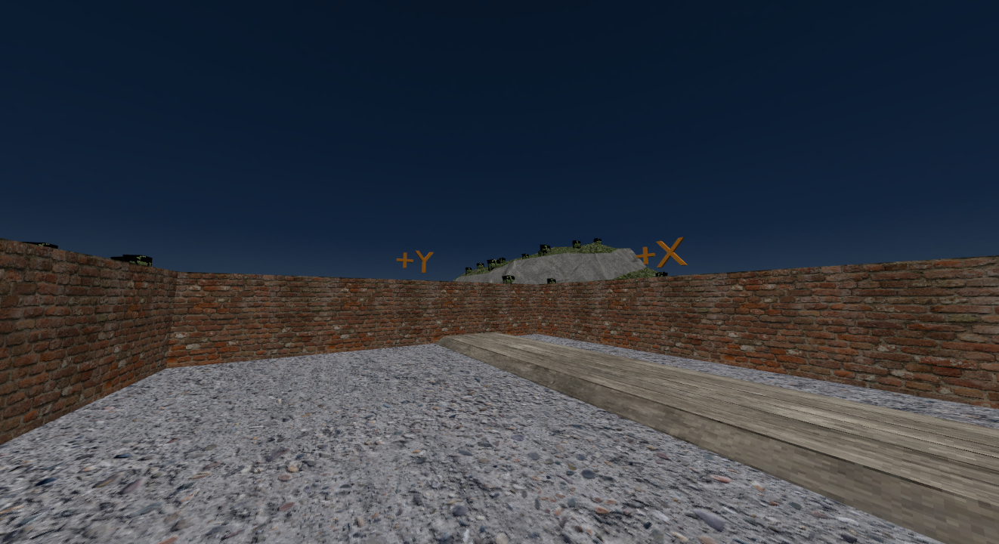
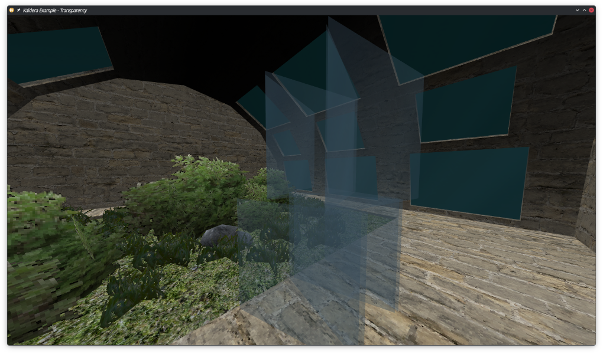
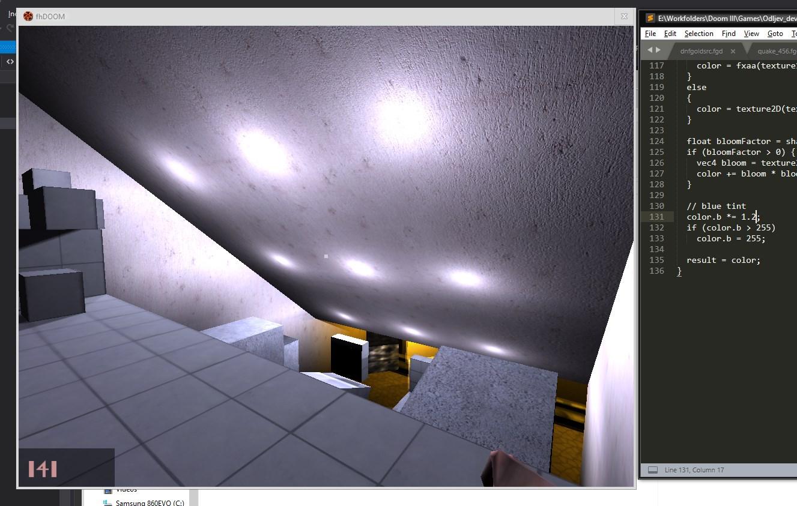
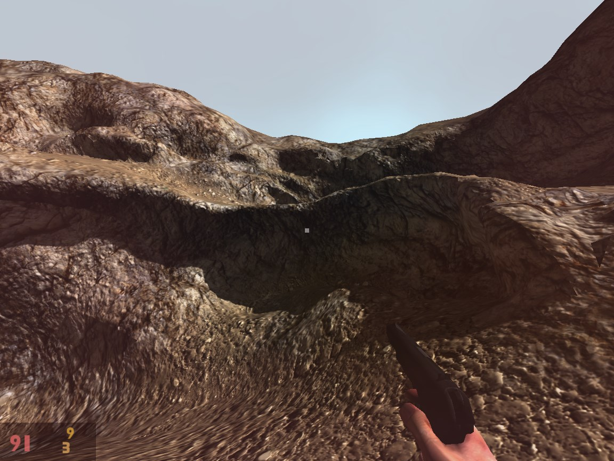
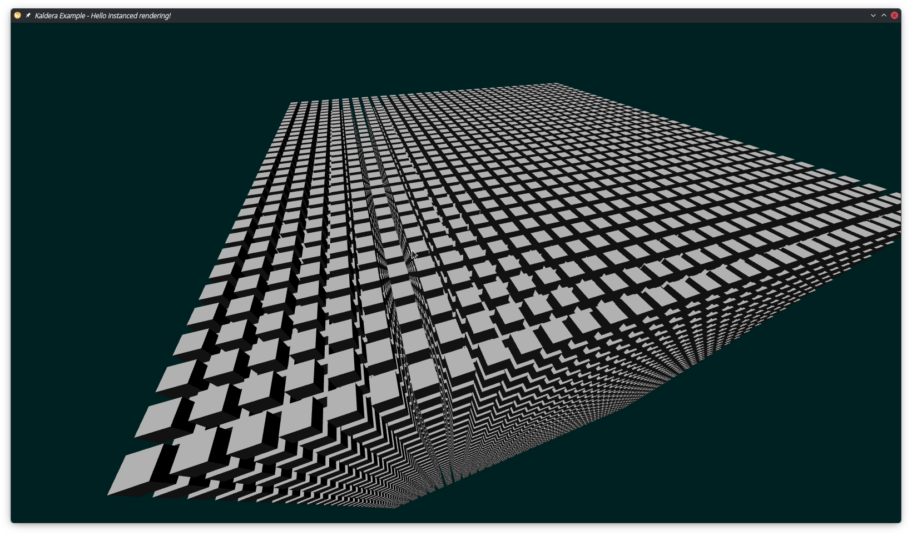
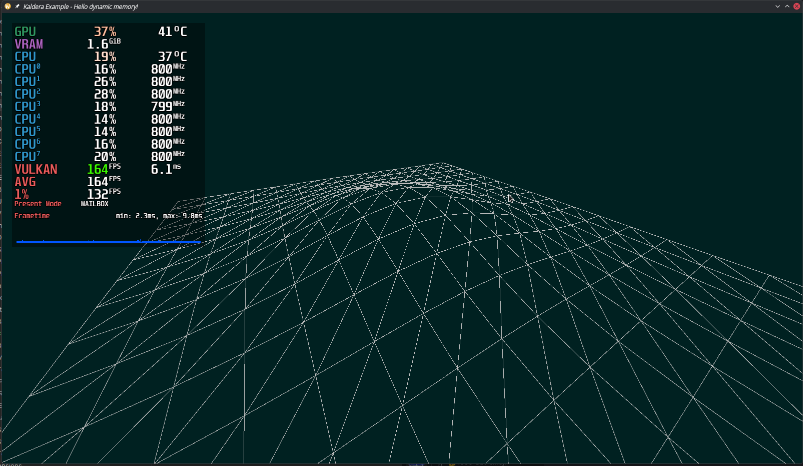
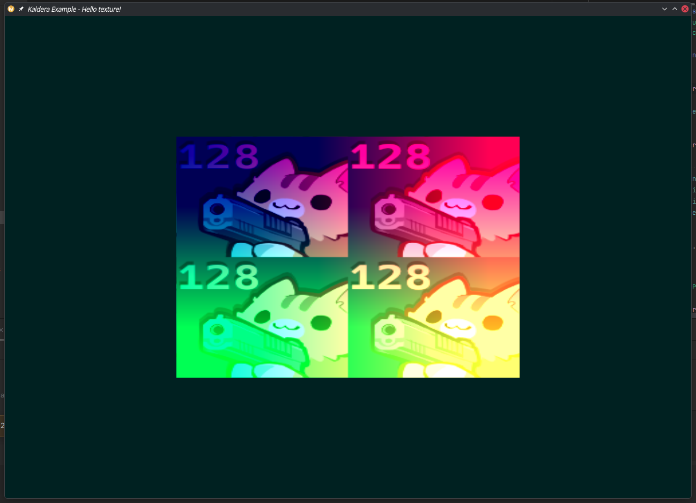

# My lil' Vulkan experiment

First off, here is the repository: https://github.com/Admer456/kaldera

Over the past couple months, I've been building a light Vulkan framework(?) in C#. It's based on Vulkan 1.4, uses Silk.NET bindings, and I've been using it with Slang. For now, I'm sticking to the name "Kaldera", but it's not set in stone.



<!-- truncate -->



To put it shortly, after years of OpenGL, then NVRHI (as well as trying Diligent, BGFX etc.) and then running a fork of a fork of Veldrid, I decided to finally try out Vulkan 1.4. I was quite encouraged by Sebastian Aaltonen's [No Graphics API](https://www.sebastianaaltonen.com/blog/no-graphics-api) blog post.

My focus is mostly on Linux and Windows, with some interest in PCVR. I'll be using it in my retro FPS game engine (mostly CPU-driven rendering), so I need really good CPU throughput, very little indirection and such.

I'm also interested in GUI 3D editor apps (read: Avalonia integration), so that's another factor while designing the API. Not interested in web nor Android, though I *may* potentially look into Android for standalone VR one day.

You may skip the first two sections here if you're only interested in the library.

## Some of my history

It was 2014. I was in 7th grade and we began learning QBasic 4.5. We started with simple programs, learning variables, conditionals, loops and the like. By the end of that year, we were doing some really, really basic graphics.

```vb
SCREEN 1
LINE (110, 70)-(190, 120), 3
```

That was the start of my graphics journey, believe it or not.

Fast-forward to late 2019, I was in high school, working on my second little game prototype in idTech 4 (the Doom 3 engine). The first one did well at a local gamedev competition, and for the second one I wanted some pretty nice looks.

I was using a fork of the engine that had OpenGL 3.3 and GLSL shaders. Having a little C++ knowledge, I figured: if GLSL is a C-like language and shaders are really just code, could I write my own?



Yes. Yes you could.

Soon enough, I got my hands on some PBR shading code. All it really did was change the specular highlights to be driven by roughness & metallicness, not your usual specular map. There was no image-based lighting or anything like that, but I was happy.



I also achieved something I (and some other idTech 4 users) considered a holy grail at the time: 4-way texture blending with vertex colours! All this thanks to shader programming and me slowly getting comfy with OpenGL.

This just encouraged me to get into graphics APIs. In 2020 I started learning OpenGL 3.3 raw. I picked up SDL2, GLEW and LearnOpenGL. I learned quite a bit, including instanced rendering. Fun stuff! I also got into idTech 3 in late 2020, which helped me learn so much about game engine architecture and whatnot.

In late 2021, I was working on a Quake 2 RTX based project with a few folks, and we were in touch with Alexey Panteleev (nVidia engineer, worked on Q2RTX), who recommended me NVRHI as I was looking to try Vulkan. Later on, 2022-2023, I switched to Veldrid as I overall switched to C#.

It was all pretty neat and I was introduced to "modern" graphics programming concepts. However, I found myself missing some of the flexibility from OpenGL. So I started looking into Vulkan extensions, to see if I could maybe modify Veldrid for my needs.

## Old, new, "modern" and modern graphics

I said "modern" with quotes. Graphics programming techniques have evolved over the years. I'll specifically talk about getting geometry on the screen, how drawcalls evolved over time and shader IO.

So, initially with OpenGL 1.0, you'd immediately upload any and all rendering data when drawing.
```cpp
glBegin( GL_TRIANGLES );
glVertex3f( ... ); // To render meshes, you can imagine
glVertex3f( ... ); // these vertex3f calls being in a loop
glVertex3f( ... );
glEnd();```
```

This here would've been one drawcall. Video cards of the time were designed for it. If you wanted to upload texture coordinates, you'd have to call a bunch of `glTexCoord2f` as well.

Ignoring triangle fans and such, you then had OpenGL 1.1 with the ability to upload a buffer of vertices:
```cpp
glBegin( GL_TRIANGLES );
glVertexPointer( ... );
glEnd();
```

Efficiency improved, but this is still heavily, heavily CPU and IO bound. This era is what I call "old". Immediate mode, no shaders, nothing. Eventually, with OpenGL 2.0, we got retained mode rendering, where you upload a buffer to video memory and draw that, referring to it using a handle.

```cpp
GLuint vertexBuffer;
glGenBuffers( 1, &vertexBuffer );
glBufferData( ... );
...
glBindBuffer( GL_ARRAY_BUFFER, vertexBuffer );
glDrawArrays( GL_TRIANGLES, 0, numTriangles );
```

Now, we could also insert an index buffer here somewhere, but that's besides the point. The major speedup here was moving from uploading the render data every frame to uploading the render data once, and only uploading an integer handle every frame. Pretty neat!

Direct3D 7 had a similar mechanism, way before OpenGL 2.0.

```cpp
LPDIRECT3DVERTEXBUFFER7 pVertexBuffer;
d3dDevice->Create( ..., &pVertexBuffer );
...
d3dDevice->DrawPrimitive( ..., &pVertexBuffer );
```

(I cobbled this together from Direct3D 9 documentation and [this archive](https://library.thedatadungeon.com/directx7/devdoc/live/directx/imref_3d0k.htm) of Direct3D 7's APIs)

Around this time (early 2000s), we also got shaders. Before shaders, if you wanted to implement specular mapping (with a special texture for it!), you would've had to render your surface in two passes: opaque diffuse + additive specular. You'd use vertex colours to calculate the shading.

```cpp
CalculateDiffuseVertexColours( numVerts, vertices, diffuseVertexColours );
CalculateSpecularVertexColours( numVerts, vertices, specularVertexColours );

// calls glVertexPointer/DrawPrimitive etc.
DrawEntity( vertices, DIFFUSE_MAP, RENDERMODE_OPAQUE, diffuseVertexColours );
DrawEntity( vertices, SPECULAR_MAP, RENDERMODE_ADDITIVE, specularVertexColours );
```

You could now do all of that in a single pass. So yeah. Vertex buffers, index buffers, shaders -> efficiency improved. It improved even more when we got instanced rendering. This era (early to mid 2000s) is what I call "new", but it is not modern!

What sets the "modern" era apart from the "new" era (besides ray tracing, mesh shading etc.) are command buffers and pipeline state objects.

Pipeline state up to DirectX 11, and up to OpenGL 4.6, was handled dynamically. You could change depth testing, rasterisation options, blending etc. practically whenever you wanted!

```cpp
glEnable( GL_DEPTH_TEST );
glDepthFunc( GL_LESS );
glDepthRange( ... );
...
glDrawIndexed( ... );
```

Shader IO was handled the same way. But, what ended up happening was, the CPU was wasting time setting this all up dynamically. What if there was a way to sorta precache all of these "rendering options"? Could we also maybe "cache" drawcalls somehow? Just record them to some list and reuse them...

That's literally what command buffers and PSOs are. PSOs contain a set of shaders, rasterisation settings, blending functions, constants and a load of other "configs" for rendering, so to speak. Command buffers are especially cool because now each thread can have its own little command buffer, so you could split up the work of issuing some 10'000 drawcalls across multiple threads.

This led to the creation of Vulkan, DirectX 12 and Metal in the mid 2010s, the "modern" era. The idea was to bake everything, and I mean EVERYTHING, especially in Vulkan. If you resized your window, there goes the pipeline, you gotta rebuild the thing with a new viewport size. (thankfully, viewport & scissor size can be easily made dynamic)

Shader inputs were described by descriptors. Descriptors were grouped into descriptor sets. They all had to be baked ahead of time, and you can imagine how much of a pain this would become for shader permutation systems, dynamic material properties and the like.

There's more details about this in Sebastian Aaltonen's [No Graphics API](https://www.sebastianaaltonen.com/blog/no-graphics-api) and Amini Allight's [vknew](https://amini-allight.org/post/vknew-modern-vulkan-with-descriptor-indexing-dynamic-rendering-and-shader-objects). You'll see a narrative like this more or less everywhere. But in a nutshell, Vulkan 1.0 was a huge compromise. It was gonna be this graphics API of the future, yet it also had to support GPUs going a few years back, like the GTX 600 series (2012). And so it came out in 2016, imperfect as it was.

This brings me to 2026, the "new modern" era. Vulkan 1.4 has so many nice things:
* dynamic rendering (1.3) - you don't have to build render pass objects any more
* push descriptors (1.4) - you don't have to build descriptor sets any more, just dynamically submit your descriptors
* extended dynamic state (1.3) - you can change depth testing, raster options, blending, MSAA etc. dynamically
* shader objects - you can bind shaders dynamically too, skip pipelines altogether
* descriptor indexing (1.2) - you can have bindless textures and access them in a shader like a huge array of textures
* multiview (1.2) - you can easily render to 2 or more framebuffers efficiently from different POVs
* lots of API restrictions got relaxed and subtle improvements made

Over the years, some pretty interesting techniques have also cropped up. Using an elaborate setup of compute shaders, and indirect (and instanced? :3) rendering, your CPU doesn't need to do almost any work. A mere couple dispatches and drawcalls could render the whole scene. Rendering today can simply boil down to translating your CPU-side representation of a rendering engine into a GPU-side one.

If, on the CPU side, you have an array of textures, an array of materials, an array of models, and finally an array of renderable objects, why not have *all* of that mirrored on the GPU? That, my friend, is the pinnacle of modern rendering. At least to some people. I dunno.

What truly excites *me* is that we've almost come full circle. You can now implement OpenGL 1.0 in Vulkan with relative ease. We now have much of the flexibility the old APIs had (dynamic pipeline states), with the benefits of a modern API (true multithreading, barriers and the like).

## The problems I wanna solve

Tired of working with Veldrid's Vulkan 1.0 backend, and wanting to try some Vulkan 1.4 goodies, I went ahead and started building a very thin OOP-ey wrapper for Vulkan. The idea was that the Vulkan instance, physical devices, logical devices and others would be objects with methods, and their `*CreateInfo` structures would also be simplified.

### The deceit 

In the renderer abstraction libraries I've used, the thing I never liked is that the abstracted API is sort of "deceiving" you. Calling `CommandBuffer.BindPipeline` does not actually call `vkCmdBindPipeline`. Instead, it just saves a reference to your abstracted pipeline object, and performs the actual Vulkan call (as well as binding descriptors etc.) the moment you issue a drawcall.

I've been using Veldrid for a good while, so I can tell you this is what happens when you call `DrawIndexed`:

```cs
private override void DrawIndexedCore( ... )
{
    PreDrawCommand();
    vkCmdDrawIndexed(_cb, indexCount, instanceCount, ...);
}
```

Hmm... what's this `PreDrawCommand`?

```cs
private void PreDrawCommand()
{
    if (_viewportsChanged)
    {
        _viewportsChanged = false;
        FlushViewports();
    }

    if (_scissorRectsChanged)
    {
        _scissorRectsChanged = false;
        FlushScissorRects();
    }

    if (_vertexBindingsChanged)
    {
        _vertexBindingsChanged = false;
        FlushVertexBindings();
    }

    EnsureRenderPassActive();

    FlushNewResourceSets(
        _currentGraphicsResourceSets,
        _graphicsResourceSetsChanged,
        _currentGraphicsPipeline!);
}
```

Oof... not very good. For fun, let's see what NVRHI does:

```cs
void CommandList::drawIndexed(const DrawArguments& args)
{
    assert(m_CurrentCmdBuf);

    updateGraphicsVolatileBuffers();

    m_CurrentCmdBuf->cmdBuf.drawIndexed(args.vertexCount,
        args.instanceCount,
        args.startIndexLocation,
        args.startVertexLocation,
        args.startInstanceLocation);
}
...
void CommandList::updateGraphicsVolatileBuffers()
{
    if (m_AnyVolatileBufferWrites && m_CurrentGraphicsState.pipeline)
    {
        GraphicsPipeline* pso = checked_cast<GraphicsPipeline*>(m_CurrentGraphicsState.pipeline);

        bindBindingSets(vk::PipelineBindPoint::eGraphics, pso->pipelineLayout, m_CurrentGraphicsState.bindings, pso->descriptorSetIdxToBindingIdx);

        m_AnyVolatileBufferWrites = false;
    }
}
```

It's better, but this always felt a little off. It felt dirty, almost like a hack. It's perfectly understandable though. You can't really have a thin wrapper and support 3-4 different GAPIs at the same time. That's okay. But that ain't for me - I'm only interested in Vulkan.

A drawcall in Kaldera is just this:

```cs
public void DrawIndexed( int indexCount, int instanceCount )
{
	Vulkan.Vk.CmdDrawIndexed( VkCmdBuf, (uint)indexCount, (uint)instanceCount, 0, 0, 0 );
}
```

There. That's all I want. A very clear and direct connection to the graphics API. Now, of course, you might *prefer* having multiple GAPIs and see the "deceit" as reasonable design. I think that's valid, and it may be quite beneficial if you're not after advanced features or you're targeting plenty of platforms. That's all good, but my priority is just Linux and Windows, and I want something that *really* scratches my itch.

But then, as I looked more into it, I realised this thin object wrapper is still verbose. It alone is not enough for a truly comfy Vulkan experience. I needed utilities for creating different kinds of buffers, textures and such. I needed the concept of a render target.

### You can't do that!

Thinking about these things, building the wrappers, I also learned that different GPUs support different sets of operations for different image formats. One device may support compute RW on `D32_SFLOAT`, another may not.

So, with the last 8 years of desktop GPUs in mind, I decided to translate this support matrix (+ any API restrictions) to the type system:
* `Texture` - general 1D and 2D texture (sampling, blitting, RW, arraying)
* `TextureCompressed` (not implemented a.t.m.) - compressed 2D texture (sampling, blitting, arraying)
* `Texture3D` (not implemented a.t.m.) - 3D texture (sampling, blitting, RW)
* `TextureArray<T>` - multi-layer textures
* `AttachmentColour` - colour attachment texture (sampling, blitting, RW, arraying, MSAA)
* `AttachmentDepthStencil` - DS attachment texture (blitting, arraying, MSAA) - locked to `D32_SFLOAT` or `D32S8_SFLOAT`
* `AttachmentShadingRate` (not implemented a.t.m.) - variable rate shading tex (sampling, blitting, RW, arraying) - locked to `R8G8_UINT`

There's something similar for buffers. `StorageBuffer`, `VertexBuffer<T>`, `IndexBuffer` and all. Vertex buffers are peculiar because there's technically a support matrix for different buffer types and formats, though in practice, any reasonable vertex attribute format is always supported. There are also uniform texel buffers, storage texel buffers, acceleration structure-related buffers and different GPUs support different formats for them, but those are not a priority right now.

One alternative here would be to let the programmer check if the GPU supports particular usages/operations on individual formats. That's cool, but it still lets you make mistakes. I am willing to sacrifice a little flexibility for a *great* deal of safety.

So, my plan is to download a bunch of GPU profile JSONs from the Vulkan Hardware Database - GTX 1050 Ti to RTX 4060, RX 6600 to RX 9060 XT and the like - and boil down the massive list of formats to different enums for each usecase.

For colour attachments, you'd only use specific formats. For `TextureCompressed`, you could only use other specific formats and such. It's a small aspect of my framework and it may feel a little restrictive, but it lets me avoid potential runtime errors. It's peace of mind. Not implemented yet, but the types are at least separated.

### An ally of cache

Shader resources (buffers, textures, samplers) are simple **value types**. This lets me stuff them into arrays and maintain a degree of cache friendliness. Having used ECS libraries and BepuPhysics, it's a pattern that I've come to enjoy quite a bit.

There's also a `Box<T>` wrapper if you really need the convenience of a reference type. Render targets and queues are reference types from the get-go (and some use `Box<T>` internally), as there won't be a lot of those, and you wouldn't reference them very frequently. I think that's reasonable.

### Low-compromise

In a lot of these libraries, Vulkan felt like some sort of 2nd-class citizen. NVRHI was geared more towards DirectX 12 and HLSL. Vanilla Veldrid had missing image layout transitions and a load of other issues.

In theory, it would've made extensions more difficult too. Not caring about OpenGL, Metal or DirectX 11 though, I only made direct modifications to Veldrid's Vulkan backend. A proper approach would've been something else, implementing features in the common/public API or such. But again, the "deceit" from earlier would've made that less straightforward.

So, yeah. Absolutely none of that here. This is a Vulkan-first library. You are free to e.g. write extension methods for the command buffer. You are free to load any Vulkan device extension you want. You are free to alter feature structs when initialising the Vulkan context. This is really just my vision for a comfy Vulkan.

## Examples

Alright. You wanna see what it looks like. Here:

Initialisation (abstracted):
```cs
// Instance, device, queue, this gets you all of that
var graphicsContext = Startup.CreateVulkan14Context( new()
{
    ApplicationName = ...;
    EngineName = ...;
    InstanceExtensions = ...;

#if DEBUG
    LogMethod = ...; // Debug logging
    LogLevel = VulkanDebugLogLevel.Error,
    OptionalLayers = [ LayerNames.KhronosValidation ];
#endif
} );
```

Basic rendering:
```cs
commands.Begin();
commands.RenderInto( renderTarget, () => {
    commands.BindPipeline( pipeline );
    commands.SetViewport( 0, ... );
    commands.SetScissor( 0, ... );

    commands.PushUniformBuffer( cameraBuffer, 0, 0 ); // set 0 binding 0
    commands.PushSampledTexture( texture, 1, 0 ); // set 1 binding 0
    commands.PushSampler( sampler, 1, 1 ); // set 1 binding 1

    commands.BindVertexBuffer( 0, vertexBuffer );
    commands.BindIndexBuffer( indexBuffer );
    commands.DrawIndexed( indexBuffer.Count, instanceCount: 1 );
} );
commands.End();
queue.Submit( commands, renderTarget );
```

Compute shader writes, another one reads:
```cs
commands.BindPipeline( computePipeline1 );
commands.PushStorageBuffer( someBuffer, 0 );
commands.Dispatch();

commands.Barrier( BarrierStages.Compute, BarrierStages.Compute );

commands.BindPipeline( computePipeline2 );
commands.PushStorageBuffer( someBuffer, 0 );
commands.Dispatch();
```

Resource creation:
```cs
// Prepares a couple staging buffers and a command buffer
UploadHelper uploader = ResourceBuilder.Create( allocator, reserveInBytes );

// This here creates the resource object (buffer or tex)
// and issues a copy command internally
vertexBuffer = uploader.CommitVertexBuffer<PosNormalUv>( data );
indexBuffer = uploader.CommitIndexBuffer( indices );
texture = uploader.CommitTexture( pixelData, format, width, height, mips, imageLayout );

// All those copy commands gotta be submitted to the queue
uploader.Upload());
...
// The uploader does not own the resources, it's just a temporary thing
uploader.Dispose();
```

Updating data:
```cs
UploadHelper uploader = ...; // Create at load time
...
uploader.Reset(); // Done every frame or whenever needed
uploader.UpdateBuffer( vertexBuffer, data );
uploader.UpdateTexture( texture, pixelData );
uploader.Upload();
```

Downloading data, reading back from the GPU: (not implemented yet, API might change)
```cs
DownloadHelper reader = DownloadHelper.Create( queue, reserveInBytes );
...
// The data is not immediately ready
reader.Schedule( vertexBuffer );
reader.Schedule( indexBuffer );

// This will wait for the reading operation to finish
reader.Download();
...
// When done, you can just read the data
Span<uint> indexData = reader.Get( indexBuffer );
```

There's also a bucketload of narrow examples in the repository.

Instanced rendering:


Dynamic mesh updates (+ compute shader equivalent):


Working with textures:


There are "introductory" samples which narrowly focus on specific API functionalities and stuff, there's a self-contained "hello triangle" example, and then there are more high-level examples (model loading, transparency, multithreaded drawcalls...).

## Design

There are two layers: the base API and the abstractions. The base API is mostly just Vulkan objects in a thin but comfy wrapper, an allocator abstraction and some basic utilities.

So, the base API has these types, together with their `*Options`:
* `Instance`
* `PhysicalDevice`
* `Device`
* `Queue`
* `CommandBuffer`
* `Swapchain`
* `Image`
* `ImageView`
* `Sampler`
* `Buffer`
* `Layout`
* `Shader`
* `ShaderSet` -> `NullShaderSet`, `ComputeShaderSet`, `VertexPixelShaderSet`, `VertexShaderSet`
* `IPipeline` -> `GraphicsPipeline`, `ComputePipeline`
* `IResourceAllocator` -> `SimpleAllocator`
* `Result`/`Result<T>`

You create images and buffers through an `IResourceAllocator`. Memory blocks are not exposed. There are also some startup utilities like `DeviceSelection` and `StructureChain`.

The abstraction layer is there to make life easier when uploading/reading data to/from the GPU, managing resources and the like. You don't have to use it, though.

It has these types:
* `Texture`
* `TextureCompressed` - not yet
* `Texture3D` - not yet
* `TextureArray<T>`
* `AttachmentColour`
* `AttachmentDepthStencil`
* `AttachmentShadingRate` - not yet
* `VertexBuffer<T>`
* `StorageBuffer`
* `IndexBuffer`
* `StagingBuffer`
* `LayoutBuilder`
* `ResourceBuilder`
* `UploadHelper`
* `DownloadHelper` - not yet
* `Startup`
* `SwapchainRenderTarget`
* `TextureRenderTarget`
* `Box<T>`

### C# my way

I also took the liberty of experimenting with an `Error`/`Result<T>` type. This still needs some refinement, but anything is good if it aids me in avoiding exceptions. The general pattern for object creation goes:
```cs
Result<Classname> res = Classname.Create( options );
if ( !res.Get( out var error, out var value ) )
{
    return error.Prepend( "Failed to do xyz" );
}
```
In your application code, you may have an extension method:
```cs
Classname obj = Classname.Create( options ).Checked();
```
This custom `Checked()` extension would maybe log to your engine, attach a debugger and whatnot.

### Synchronisation

Synchronisation is simplified to stages and hazards. Render targets will automatically synchronise images, but for most common tasks (compute write then pixel shader read) you gotta place (simplified) barriers.

```cs
var beforeStage = BarrierStages.Transfer;
var afterStage = BarrierStages.Graphics;
var hazardFlags = HazardFlags.ReadAfterWrite; // default for Barrier()

commands.Barrier( beforeStage, afterStage, hazardFlags );
```

This is a bit like No Graphics API's barrier model. Still, if need be, you can use "full" memory barriers with stage and access masks.

### Tradeoffs

Now, I mentioned No Graphics API, but I'm not copying it. Someone [already did that](https://github.com/LeonardoTemperanza/no_gfx_api) and it's quite nice. However, it's a bit too futuristic. My motherboard does not have ReBAR, unified image layouts are only really supported by nVidia, so one still needs to deal with layout transitions. We are not there *yet*, but we aren't too far away, it would appear.

My goal is to support the last 8 years (give or take) of GPUs at all times. When I started to use NVRHI and Veldrid, I wanted to support 2014 cards like the GTX 750 Ti. Now, that's the GTX 1050 Ti. As far as I'm concerned, it'll remain relevant for a while. These are still fairly capable devices, especially for retro gaming, and given I wish to make retro games, it would be ideal to support *even* older hardware like the GTX 600 series.

However, that may also mean making my life hell as a developer. It's all a balancing act. I think supporting 8 years back - maybe 10 if the AI industry keeps fucking everything up - is reasonable.

So, with all this balancing in mind, I like to think I've made something pretty comfy. A pretty okay compromise.

I don't reckon too much will change in the next 2 years? Descriptor heaps are a brand new feature, having come out in January this year (2026), so they will remain exotic for a little while. Unified image layouts may remain nVidia-only. But that's just my gut feeling. I do hope more QoL stuff gets adopted, but, I'm not sure I'll be switching to a Vulkan 1.5 anytime soon.

## Future work

I am still missing descriptor indexing, multiview, VMA bindings and some smaller things (below). I also want Avalonia and OpenXR integration, so I'll be working on all that in the upcoming weeks.

The "smaller things" include readback via `DownloadHelper`, I haven't tested mipmapping, and right now there is no G-buffer render target (nor a fragment shading rate attachment). `TextureRenderTarget` only supports one format, even if it can have more than one texture inside. So yeah, this is still very much early.

Heck, I don't even know if this will work on Windows or AMD GPUs. I've done everything on my NixOS setup so far, with an RTX 3060. My brother has an RX 6600, so we'll see, I suppose. I ought to clean up my Win10 installation on that 250 GB SSD, too. Now that's the fun part about graphics programming.

Anyway, Slang & SPIR-V utilities would be a plus for some folk, so you could obtain set/binding IDs, for example by name.

Much later, I'd like to explore this one concept further: catching potential runtime errors at compile-time. One thought I had was a code generator that would read a list of GPU profile JSONs and extract lists of formats for different usecases. That way, you download a list of GPUs you want to support, and find what they all have in common. You could also load extensions this way. In general, I'm thinking of some kind of "support validator". We'll see.

On that note, I'll probably clean up some of the datatypes, see if it's worth merging `Texture` and `TextureCompressed`. There is also no indirect rendering yet, so there would have to be an `IndirectBuffer` and relevant commands.

Multi-GPU is a thing for the far future, but it's a curiosity of mine. Might play around with that, but right now it's super far away. It's also pretty niche as not a lot of people have more than one dedicated graphics card, if one at all! Still, it could be useful to speed up baking lighting or stuff like that.

Finally, I'd love to have a nice, proper extension system. Essentially, you'd have NuGet packages that are literally just certain Vulkan extensions. They'd come with some extra types and extension methods for command buffers for example. Ray-tracing and mesh shading pipelines could very well be implemented this way. Very modular, and very plug'n'play.

I hope, one day, this will be a small but positive contribution to the world of graphics and C#. Thanks for reading. 🤍
