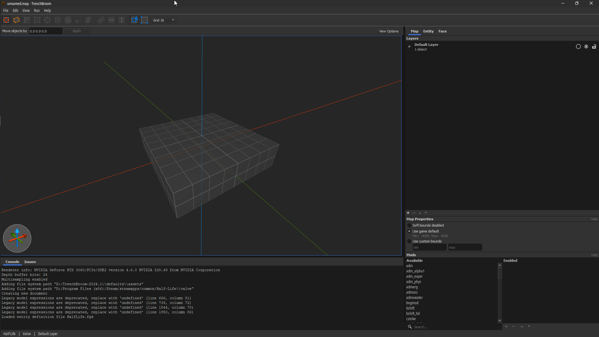
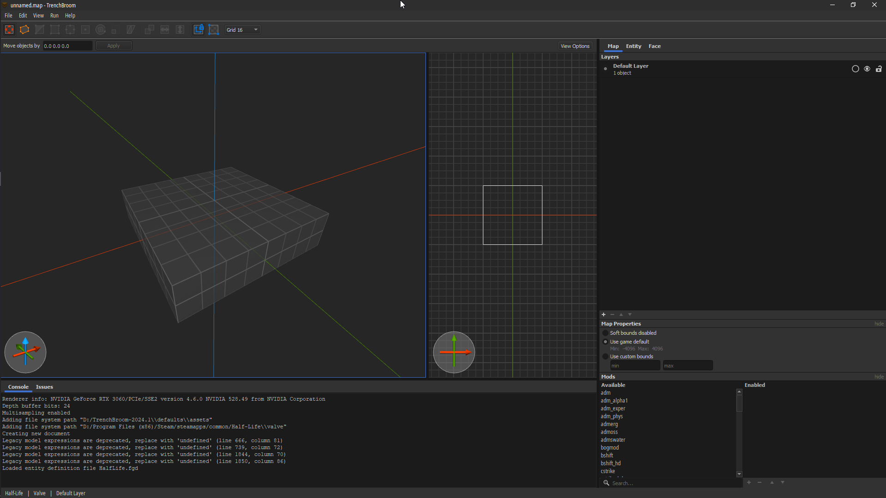
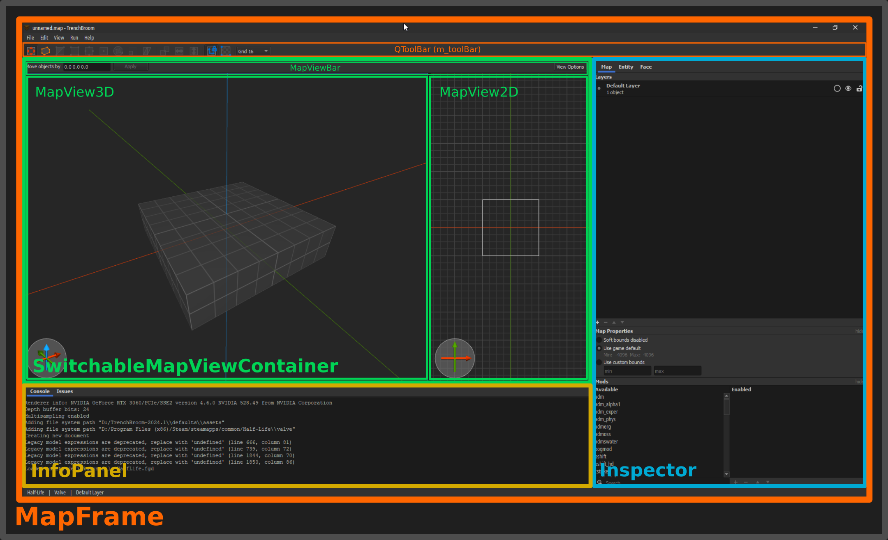

# Chapter 5: View

Here we come across the *big picture*. The View layer. We'll focus on the main TB view:



In fact, let me drag out a 2D view:



Perfect. Let's dissect this.

## Core layout

The root of all this is a `MapFrame`.
```cpp
class MapFrame : public QMainWindow
{
//...
  std::shared_ptr<MapDocument> m_document;
//...
  SwitchableMapViewContainer* m_mapView = nullptr;
//...
  QPointer<MapViewBase> m_currentMapView;
  InfoPanel* m_infoPanel = nullptr;
  Console* m_console = nullptr;
  Inspector* m_inspector = nullptr;
//...
  QPointer<QDialog> m_compilationDialog;
  QPointer<ObjExportDialog> m_objExportDialog;
//...
private: // shortcuts
  using ActionMap = std::map<const Action*, QAction*>;
  ActionMap m_actionMap;
//...
public:
  MapFrame(FrameManager& frameManager, std::shared_ptr<MapDocument> document);
  ~MapFrame() override;
//...
};
```

In essence:
* `MapFrame` hosts the entire UI,
* `MapViewBase` instances (`MapView3D`, `MapView2D`, hosted by `SwitchableMapViewContainer`) are renderable viewports that accept various user input events, and
* `MapDocument` is the central component of all map editing operations.
* All UI classes have a `createGui` method - called from the constructor - and it creates all necessary widgets and layout, e.g. labels, images, splitters etc.
* Some UI classes have a `connectObservers` method - called from the constructor - and it connects the class' methods to various editing events, e.g. changes to entities.

:::info[Keep in mind]
`MapDocument` is not a UI component, but rather a host of map data and a set of operations on said data. Widgets and actions of all sorts ultimately interact with `MapDocument`, and so do other layers, indirectly so.
:::

Here is a more visual illustration of all this:



Hopefully this will help you navigate the code a bit! From here onward you can pretty much intuit the location of everything else in TrenchBroom, e.g. the "View Options" button in `MapViewBar`, or the "Face" tab in `Inspector`.

## Event loop

Most of the core event handling business is done in `MapViewBase`, which also supports rendering. `MapFrame` is what creates these "map views" as well as creating a `MapDocument`.

The flow of events goes like this:
1. The user interacts with a smart editor, or uses an action via a keyboard shortcut:
	1. The respective UI component interacts with `MapDocument` to modify some nodes for instance.
	2. `MapDocument` proceeds to visit the selected nodes.
2. The user interacts with a 2D or 3D viewport:
	1. Events are passed to `MapViewBase`, which, inheriting from `ToolBoxConnector`, passes it over to a `ToolChain`.
	2. The currently appropriate `ToolController` interprets the event, e.g. `ExtrudeToolController`.
	3. The controller then interacts with its respective `Tool`.
	4. The tool interacts with `MapDocument` to modify some geometry for instance.
	5. Finally, `MapDocument` proceeds to visit e.g. selected brush nodes.

## Reacting to changes

TrenchBroom has this thing called `NofifierConnection`, and it's basically a way of observing changes in other UI components.

```cpp
void MyWidget::connectObservers()
{
  notifierConnection += notifier.connect(this, &MyWidget::myObservingMethod);
}
```

For example, the entity property editor observes changes in the map document!

```cpp title="src/common/View/EntityPropertyEditor.cpp"
void EntityPropertyEditor::connectObservers()
{
  auto document = kdl::mem_lock(m_document);
  m_notifierConnection += document->selectionDidChangeNotifier.connect(
    this, &EntityPropertyEditor::selectionDidChange);
  m_notifierConnection +=
    document->nodesDidChangeNotifier.connect(this, &EntityPropertyEditor::nodesDidChange);
}
```

Every time the user selects another entity or modifies the selection (e.g. by pressing PgUp or PgDn to change their position), the entity editor is updated to reflect those changes. For bookkeeping purposes, each UI class that connects to notifiers, needs to have a `NotifierConnection` member.

The other side of this story is `Notifier<T>` which, if you're coming from C#, is essentially like `event Action<T>`, with added C++ fluff. In either case, it's a super powerful component of TB's code:
```cpp title="src/common/View/MapDocument.h"
class MapDocument : public Model::MapFacade, public CachingLogger
{
  //...
  Notifier<MapDocument*> documentWillBeClearedNotifier;
  Notifier<MapDocument*> documentWasClearedNotifier;
  Notifier<MapDocument*> documentWasNewedNotifier;
  Notifier<MapDocument*> documentWasLoadedNotifier;
  Notifier<MapDocument*> documentWasSavedNotifier;
  Notifier<> documentModificationStateDidChangeNotifier;
```

And here is how they're invoked:
```cpp
void MapDocumentCommandFacade::performSelect(
  const std::vector<Model::BrushFaceHandle>& faces)
{
  selectionWillChangeNotifier();
  // ...
  Selection selection;
  selection.addSelectedBrushFaces(selected);

  selectionDidChangeNotifier(selection);
}
```
