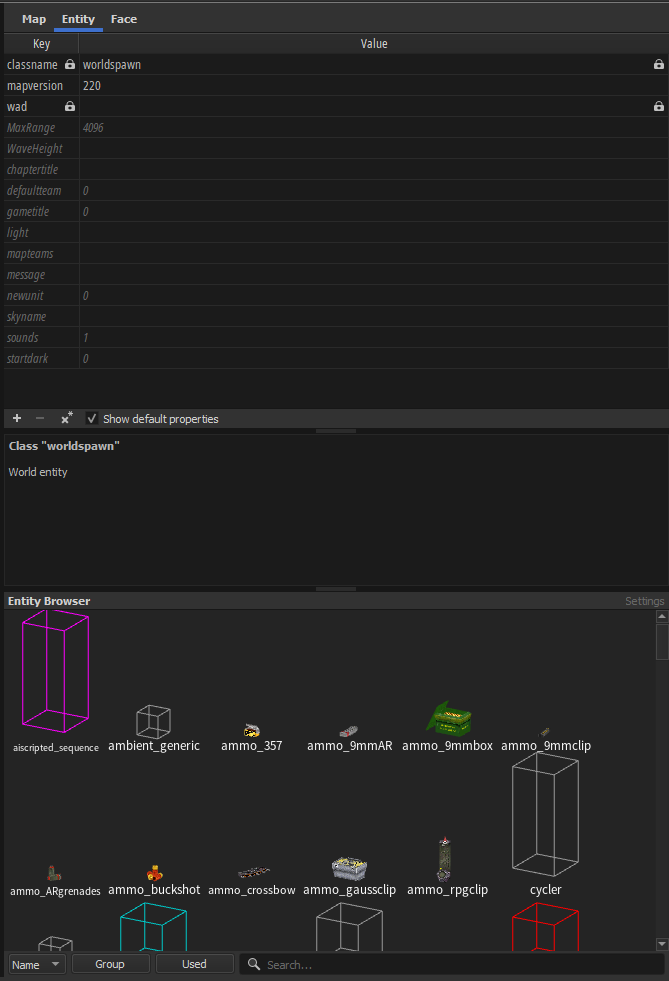
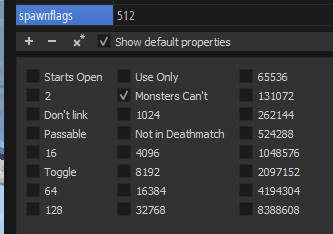
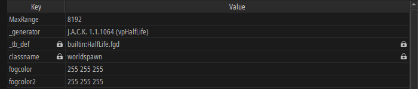
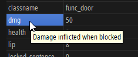
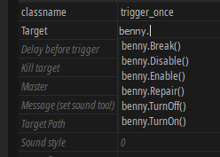

# Entity tab

This is where all the entity editing is done, and sometimes entity spawning. This page provides a small overview of the Entity tab's components.

```cpp title="common/src/View/EntityInspector.h"
class EntityInspector : public TabBookPage
{
  Q_OBJECT
private:
  QSplitter* m_splitter = nullptr;
  EntityPropertyEditor* m_attributeEditor = nullptr;
  EntityBrowser* m_entityBrowser = nullptr;
```

It is worth noting that the entity browser also hosts the settings for loading FGDs. This is done in `EntityInspector::createEntityBrowser`:
```cpp title="common/src/View/EntityInspector.cpp"
QWidget* EntityInspector::createEntityBrowser(
  QWidget* parent, std::weak_ptr<MapDocument> document, GLContextManager& contextManager)
{
  auto* panel = new SwitchableTitledPanel{
    tr("Entity Browser"), {{tr("Browser"), tr("Settings")}}, parent};

  m_entityBrowser = new EntityBrowser{document, contextManager};
  auto* entityBrowserLayout = new QVBoxLayout{};
  //...
  panel->getPanel(0)->setLayout(entityBrowserLayout);

  auto* entityDefinitionFileEditor = new EntityDefinitionFileChooser{document};
  auto* entityDefinitionFileEditorLayout = new QVBoxLayout{};
  //...
  panel->getPanel(1)->setLayout(entityDefinitionFileEditorLayout);

  return panel;
}
```

:::warning[TODO]
TrenchBroom has plenty of custom UI containers such as `SwitchableTitledPanel`. Should write about some of these.
:::

The property editor (big table covering the top half) and the entity browser are separated by a splitter. This is how it looks in TrenchBroom 2024.1:



## Entity property editor

So, this is `EntityPropertyEditor`:

```cpp title="common/src/View/EntityPropertyEditor.h"
/**
 * Panel containing the EntityPropertyGrid (the key/value editor table),
 * smart editor, and documentation text view.
 */
class EntityPropertyEditor : public QWidget
{
  Q_OBJECT
private:
  std::weak_ptr<MapDocument> m_document;
  QSplitter* m_splitter;
  EntityPropertyGrid* m_propertyGrid;
  SmartPropertyEditorManager* m_smartEditorManager;
  QTextEdit* m_documentationText;
  const Assets::EntityDefinition* m_currentDefinition;

  NotifierConnection m_notifierConnection;
```

*We have been blessed by a comment!*

:::warning[TODO]
Write about `NotifierConnection`.
:::

All of the editing happens in the entity property grid, but also smart editors:



In essence, this is just a table with additional editing options.

## Entity property grid

Now, this is where things get a little bit interesting.

```cpp title="common/src/View/EntityPropertyGrid.h"
/**
 * Panel with the entity property table, and the toolbar below it (add/remove icons,
 * "show default properties" checkbox, etc.)
 */
class EntityPropertyGrid : public QWidget
{
  Q_OBJECT
private:
  std::weak_ptr<MapDocument> m_document;

  EntityPropertyModel* m_model;
  QSortFilterProxyModel* m_proxyModel;
  EntityPropertyTable* m_table;
  QToolButton* m_addProtectedPropertyButton;
  QToolButton* m_addPropertyButton;
  QToolButton* m_removePropertiesButton;
  QToolButton* m_setDefaultPropertiesButton;
  QCheckBox* m_showDefaultPropertiesCheckBox;
  std::vector<PropertyGridSelection> m_selectionBackup;
```

The table has a bunch of buttons, but also a proxy model that filters the entity keyvalues.

```cpp title="common/src/View/EntityPropertyGrid.cpp"
  m_table = new EntityPropertyTable{};
  m_model = new EntityPropertyModel{document, this};

  // ensure the table takes ownership of the model in setModel
  // FIXME: why? this looks unnecessary
  m_model->setParent(m_table);

  m_proxyModel = new EntitySortFilterProxyModel{this};
  m_proxyModel->setSourceModel(m_model);

  // NOTE: must be column 0, because EntitySortFilterProxyModel::lessThan ignores the
  // column part of the QModelIndex
  m_proxyModel->sort(0);
  m_table->setModel(m_proxyModel);

  m_table->setItemDelegate(
    new EntityPropertyItemDelegate{m_table, m_model, m_proxyModel, m_table});

  autoResizeRows(m_table);
```

:::warning[TODO]
Okay, but why does it sort that stuff?
:::

:::info[MODEL?]
If you're new to Qt and this side of software engineering, you might be entirely confused as to what a model is. And I get it. Being someone who came from a mapping background, I got confused upon first seeing terminology like this. How did they put 3D meshes into a table, right?

You can think of models as data layouts, in this instance. That's all they really are: general data definitions. Or as Wikipedia puts it: *"[...] an informative representation of an object, person or system."* Tables, and other UI elements that display data, need models to know what to actually display.
:::

## Entity property model

This contains the current selection's entity data.

```cpp title="common/src/View/EntityPropertyModel.h"
class EntityPropertyModel : public QAbstractTableModel
{
  Q_OBJECT
public:
  static const int ColumnProtected = 0;
  static const int ColumnKey = 1;
  static const int ColumnValue = 2;
  static const int NumColumns = 3;

private:
  std::vector<PropertyRow> m_rows;
  bool m_showDefaultRows;
  bool m_shouldShowProtectedProperties;
  std::weak_ptr<MapDocument> m_document;
```

It is not a simple 2-column table, but rather a 3-column one, to show a locked icon for protected properties. Keep in mind, though, that the "protected" column isn't shown, it is instead logical, a piece of data. That little detail aside, it has a few overrides for `QAbstractTableModel`:
```cpp
  int rowCount(const QModelIndex& parent) const override;
  int columnCount(const QModelIndex& parent) const override;
  Qt::ItemFlags flags(const QModelIndex& index) const override;
  QVariant data(const QModelIndex& index, int role) const override;
  bool setData(const QModelIndex& index, const QVariant& value, int role) override;
  QVariant headerData(int section, Qt::Orientation orientation, int role) const override;
```

As well as other utilities:
```cpp
private: // autocompletion helpers
  std::vector<std::string> propertyKeys(int row, int count) const;
  std::vector<std::string> getAllPropertyKeys() const;
  std::vector<std::string> getAllValuesForPropertyKeys(
    const std::vector<std::string>& propertyKeys) const;
  std::vector<std::string> getAllClassnames() const;
// ...
private: // helpers
  bool hasRowWithPropertyKey(const std::string& propertyKey) const;
  bool renameProperty(
    size_t rowIndex,
    const std::string& newKey,
    const std::vector<Model::EntityNodeBase*>& nodes);
  bool updateProperty(
    size_t rowIndex,
    const std::string& newValue,
    const std::vector<Model::EntityNodeBase*>& nodes);
  bool setProtectedProperty(size_t rowIndex, bool newValue);
```

Let's analyse a few points of interest here:
* implementing `QAbstractTableModel`
* autocompletion
* interfacing with map entities
* handling multiple selected entities

### QAbstractTableModel implementation

This section is probably useful to you if you're learning Qt and wanna see how stuff can be done. Let's start with `QAbstractTableModel::data`:

#### Displaying data in the table

```cpp
QVariant EntityPropertyModel::data(const QModelIndex& index, const int role) const
{
  if (
    !index.isValid() || index.row() < 0 || index.row() >= static_cast<int>(m_rows.size())
    || index.column() < 0 || index.column() >= NumColumns)
  {
    return QVariant{};
  }
```

`data` returns a `QVariant`, that is to say it can return *anything*. If the index is not valid, you return an empty.

There is a concept of "roles", rather "item data roles" as they're called:
```cpp title="qnamespace.h"
    enum ItemDataRole {
        DisplayRole = 0,
        DecorationRole = 1,
        EditRole = 2,
        ToolTipRole = 3,
        StatusTipRole = 4,
        WhatsThisRole = 5,
        // Metadata
        FontRole = 6,
        TextAlignmentRole = 7,
        BackgroundRole = 8,
        ForegroundRole = 9,
```

`EntityPropertyModel` basically responds to a few of these roles, as well as the index. Depending on the column, it'll display the property name or value (the most obvious usecase), or a locked icon. 

```cpp
  if (role == Qt::DisplayRole || role == Qt::EditRole)
  {
    if (index.column() == ColumnKey)
    {
      return QVariant{mapStringToUnicode(document->encoding(), row.key())};
    }
    else if (index.column() == ColumnValue)
    {
      return QVariant{mapStringToUnicode(document->encoding(), row.value())};
    }
  }
```

So, if you want to make TB more like Hammer and display keyvalue titles from the FGD, this is the place to do it. In my own fork I do something like this:
```cpp
    if (index.column() == ColumnKey)
    {
      const auto displayFriendlyTitles = 
        document->game()->config().entityConfig.displayFriendlyTitles;

      return QVariant{mapStringToUnicode(document->encoding(),
        displayFriendlyTitles ? row.title() : row.key())};
    }
```

It also applies different fonts to properties that are using their default value, as well as for multiple-selection:
```cpp
  if (role == Qt::FontRole)
  {
    if (row.isDefault())
    {
      auto italicFont = QFont{};
      italicFont.setItalic(true);
      return QVariant(italicFont);
    }
    if (index.column() == ColumnValue)
    {
      if (row.multi())
      {
        auto italicFont = QFont{};
        italicFont.setItalic(true);
        return QVariant(italicFont);
      }
    }
    return QVariant{};
  }
```

Also, displaying the locked icon:
```cpp
  if (role == Qt::DecorationRole)
  {
    // lock icon
    if (index.column() == ColumnKey)
    {
      if (!row.keyMutable())
      {
        return QVariant{IO::loadSVGIcon("Locked_small.svg")};
      }
```



Finally, tooltips taken from FGD titles:
```cpp
  if (role == Qt::ToolTipRole)
  {
    if (index.column() == ColumnProtected)
    {
      return QVariant{"Property is protected from changes in linked groups if checked"};
    }
    else
    {
      if (!row.tooltip().empty())
      {
        return QVariant{mapStringToUnicode(document->encoding(), row.tooltip())};
      }
    }
  }
```

It results in this:  


#### Metadata about individual cells

Some cells are not editable, of course, so TrenchBroom needs to let Qt know that. And that is done `QAbstractTableModel::flags`:
```cpp
Qt::ItemFlags EntityPropertyModel::flags(const QModelIndex& index) const
{
  if (!index.isValid())
  {
    return Qt::NoItemFlags;
  }

  // ...

  auto flags = Qt::ItemIsEnabled | Qt::ItemIsSelectable;

  if (index.column() == ColumnProtected)
  {
    if (row.isProtected() != PropertyProtection::NotProtectable)
    {
      flags |= Qt::ItemIsUserCheckable;
    }
  }
  else if (index.column() == ColumnKey)
  {
    if (row.keyMutable())
    {
      flags |= Qt::ItemIsEditable;
    }
  }
  else if (index.column() == ColumnValue)
  {
    if (row.valueMutable())
    {
      flags |= Qt::ItemIsEditable;
    }
  }

  return flags;
}
```

All it's doing here is basically saying "all items are enabled" and "all items can be selected". For editable (mutable) keyvalues, it allows editing.

### Autocomplete

Do you remember these lines from above?
```cpp title="common/src/View/EntityPropertyGrid.cpp"
  m_table->setItemDelegate(
    new EntityPropertyItemDelegate{m_table, m_model, m_proxyModel, m_table});
```

Yeah. We gotta go all the way back. `EntityPropertyItemDelegate` is, as its name says, a delegate for cells in the entity property table, or in other words, a callback for them.

> *The QStyledItemDelegate class provides display and editing facilities for data items from a model.* - [Qt documentation](https://doc.qt.io/qt-6/qstyleditemdelegate.html)

Part of the item delegate API is `QAbstractItemDelegate::createEditor`, which returns a widget that helps edit a given cell.

```cpp title="common/src/View/EntityPropertyItemDelegate.cpp"
QWidget* EntityPropertyItemDelegate::createEditor(
  QWidget* parent, const QStyleOptionViewItem& option, const QModelIndex& index) const
{
  auto* editor = QStyledItemDelegate::createEditor(parent, option, index);
  auto* lineEdit = dynamic_cast<QLineEdit*>(editor);
  if (lineEdit != nullptr)
  {
    setupCompletions(lineEdit, index);
  }
  return editor;
}
```

It uses the builtin editor as a base, and sets up a `QCompleter` upon it:
```cpp
void EntityPropertyItemDelegate::setupCompletions(
  QLineEdit* lineEdit, const QModelIndex& index) const
{
  auto* completer = new QCompleter(getCompletions(index), lineEdit);
  completer->setCaseSensitivity(Qt::CaseInsensitive);
  completer->setModelSorting(QCompleter::CaseInsensitivelySortedModel);
  lineEdit->setCompleter(completer);

  connect(
    completer,
    QOverload<const QString&>::of(&QCompleter::activated),
    this,
    [this, lineEdit](const QString& /* value */) { m_table->finishEditing(lineEdit); });

  connect(lineEdit, &QLineEdit::returnPressed, this, [this, lineEdit, completer]() {
    if (completer->popup()->isVisible())
    {
      m_table->finishEditing(lineEdit);
    }
  });
}
```

Notice a few details here, such as `&QLineEdit::returnPressed` and `getCompletions(index)`.

This code essentially means, whenever the autocomplete widget pops up, or whenever the user presses Enter, apply the value to the cell. That gives us an idea how interaction is handled, but it still leaves the other part unanswered: how does it get the data?

```cpp
QStringList EntityPropertyItemDelegate::getCompletions(const QModelIndex& index) const
{
  auto completions = m_model->getCompletions(m_proxyModel->mapToSource(index));
  completions.sort(Qt::CaseInsensitive);
  return completions;
}
```

Well, that's wonderful. It asks the entity property model to get autocomplete suggestions, remapping the index to make sure it points to the same entity property. What happens next is just business as usual:
```cpp
QStringList EntityPropertyModel::getCompletions(const QModelIndex& index) const
{
  const auto key = propertyKey(index.row());

  auto result = std::vector<std::string>{};
  if (index.column() == ColumnKey)
  {
    result = getAllPropertyKeys();
  }
```

If the user is editing a key, TB will show all available keys, e.g. "classname", "health", or other things that might be listed in the FGD.

However, if the user is editing a *value*, then things get interesting:
```cpp
  else if (index.column() == ColumnValue)
  {
    if (
      key == Model::EntityPropertyKeys::Target
      || key == Model::EntityPropertyKeys::Killtarget)
    {
      result = getAllValuesForPropertyKeys({Model::EntityPropertyKeys::Targetname});
    }
    else if (key == Model::EntityPropertyKeys::Targetname)
    {
      result = getAllValuesForPropertyKeys(
        {Model::EntityPropertyKeys::Target, Model::EntityPropertyKeys::Killtarget});
    }
    else if (key == Model::EntityPropertyKeys::Classname)
    {
      result = getAllClassnames();
    }
  }
```

Depending on the type of entity property, it will offer different suggestions. For target fields, it'll offer other entity names! Pretty neat if you ask me.

:::info[FUN FACT]
One time I tried adding a basic form of Source-style IO this way, by appending `.InputName` to each appropriate entity, so the autocomplete looked something like this:  


I wouldn't recommend doing it that way though! It's best to create a smart editor for such a thing. Might wanna write about that eventually.
:::

### Interfacing with entities

:::warning[TODO]
Write this section.
:::

### Handling multiple selected entities

:::warning[TODO]
Write this section.
:::
