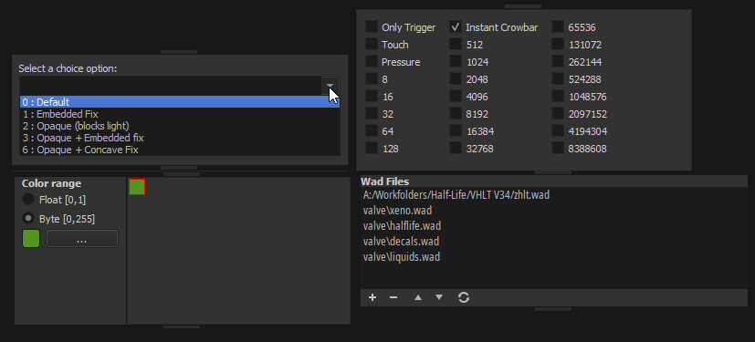

# Smart editors

TrenchBroom's "smart property editors" are essentially little editors that pop up when you're editing a particular type of keyvalue, like a target field, or a choice field.



TrenchBroom currently has these:
* `SmartChoiceEditor` - top left.
* `SmartColorEditor` - bottom left.
* `SmartDefaultPropertyEditor` - used as when there's "no" smart editor.
* `SmartFlagsEditor` - top right.
* `SmartWadEditor` - bottom right.

## `SmartPropertyEditor` base class

Here is the class itself:

```cpp title="common/src/View/SmartPropertyEditor.h"
class SmartPropertyEditor : public QWidget
{
  Q_OBJECT
private:
  std::weak_ptr<MapDocument> m_document;

  std::string m_propertyKey;
  std::vector<Model::EntityNodeBase*> m_nodes;
  bool m_active;

public:
  explicit SmartPropertyEditor(
    std::weak_ptr<MapDocument> document, QWidget* parent = nullptr);
  ~SmartPropertyEditor() override;
```

It has a few utilities, used by its subclasses:

```cpp
  bool usesPropertyKey(const std::string& propertyKey) const;

  void activate(const std::string& propertyKey);
  void update(const std::vector<Model::EntityNodeBase*>& nodes);
  void deactivate();

protected:
  std::shared_ptr<MapDocument> document() const;
  const std::string& propertyKey() const;
  const std::vector<Model::EntityNodeBase*> nodes() const;
  void addOrUpdateProperty(const std::string& value);
```

Finally, it has one virtual method:

```cpp
private:
  virtual void doUpdateVisual(const std::vector<Model::EntityNodeBase*>& nodes) = 0;
};
```

## Smart editor management

They are managed by `SmartPropertyEditorManager` and they override the `SmartPropertyEditor` base class.

The smart editors are initialised in pairs with their matcher functions:
```cpp title="common/src/View/SmartPropertyEditorManager.cpp"
  m_editors.emplace_back(
    [&](const auto& propertyKey, const auto& nodes) {
      return propertyKey
               == kdl::mem_lock(m_document)->game()->config().materialConfig.property
             && nodes.size() == 1
             && nodes.front()->entity().classname()
                  == Model::EntityPropertyValues::WorldspawnClassname;
    },
    new SmartWadEditor{m_document});
  m_editors.emplace_back(
    [](const auto&, const auto&) { return true; },
    new SmartDefaultPropertyEditor{m_document});
```

These matcher delegates basically take the key of the entity property and the selected nodes. Wonderful. Some smart editors respond to common patterns of
keys, for example "does the keyname contain XYZ?", and so there are a couple utilities for these matchers:
* `makeSmartTypeEditorMatcher` - matches for a given property type (e.g. `PropertyDefinitionType::TargetSourceProperty`)
* `makeSmartTypeWithSameDefinitionEditorMatcher` - same as above, but in case of multiple-selection, all these properties must have equal definitions
* `makeSmartPropertyEditorKeyMatcher` - matches for name patterns (e.g. `target_*` or `*color`)

As such, here they are in action:
```cpp title="common/src/View/SmartPropertyEditorManager.cpp"
  m_editors.emplace_back(
    makeSmartTypeEditorMatcher(Assets::PropertyDefinitionType::FlagsProperty),
    new SmartFlagsEditor{m_document});
  m_editors.emplace_back(
    makeSmartPropertyEditorKeyMatcher({"color", "*_color", "*_color2", "*_colour"}),
    new SmartColorEditor{m_document});
  m_editors.emplace_back(
    makeSmartTypeWithSameDefinitionEditorMatcher(
      Assets::PropertyDefinitionType::ChoiceProperty),
    new SmartChoiceEditor{m_document});
```

So yeah, if you want to write new ones, this is basically the place to do so!

### When smart editors are updated

The `doUpdateVisual` method is eventually called from here:
```cpp title="common/src/View/SmartPropertyEditorManager.cpp"
void SmartPropertyEditorManager::updateEditor()
{
  if (activeEditor())
  {
    auto document = kdl::mem_lock(m_document);
    activeEditor()->update(document->allSelectedEntityNodes());
  }
}
```

Which is called from here:

```cpp title="common/src/View/SmartPropertyEditorManager.cpp"
void SmartPropertyEditorManager::selectionDidChange(const Selection&)
{
  auto document = kdl::mem_lock(m_document);
  switchEditor(m_propertyKey, document->allSelectedEntityNodes());
}
```

There are also a couple other places to look at, such as:

```cpp title="common/src/View/EntityPropertyEditor.cpp"
void EntityPropertyEditor::OnCurrentRowChanged()
{
  updateDocumentationAndSmartEditor();
}
```

That then calls `switchEditor` which calls `updateEditor` and so on and so forth. I think you get the idea by now. TrenchBroom has plenty of layers of this stuff.

So, in essence, whenever the user selects another property to edit, updates the entity via other tools (e.g. PgUp/PgDown to move them), or selects another entity altogether, that's when `doUpdateVisual` gets called.

## Example: `SmartChoiceEditor`

This one is super simple. It is essentially a combo box wrapped into a smart editor.

```cpp title="common/src/View/SmartChoiceEditor.h"
class SmartChoiceEditor : public SmartPropertyEditor
{
  Q_OBJECT
private:
  QComboBox* m_comboBox;
  bool m_ignoreEditTextChanged;

public:
  explicit SmartChoiceEditor(
    std::weak_ptr<MapDocument> document, QWidget* parent = nullptr);

  void comboBoxActivated(int index);
  void comboBoxEditTextChanged(const QString& text);

private:
  void createGui();
  void doUpdateVisual(const std::vector<Model::EntityNodeBase*>& nodes) override;
};
```

Its GUI is *exactly* what you'd imagine:
```cpp
void SmartChoiceEditor::createGui()
{
  assert(m_comboBox == nullptr);

  auto* infoText = new QLabel(tr("Select a choice option:"));

  m_comboBox = new QComboBox();
  m_comboBox->setEditable(true);

  connect(
    m_comboBox,
    QOverload<int>::of(&QComboBox::activated),
    this,
    &SmartChoiceEditor::comboBoxActivated);

  connect(
    m_comboBox,
    &QComboBox::editTextChanged,
    this,
    &SmartChoiceEditor::comboBoxEditTextChanged);
```

:::tip
If you don't have experience with Qt or any UI framework, now is the time to learn! Read the Qt docs and build some small, simple UI apps.
:::

It responds to `QComboBox::activated`, which:

> [...] is sent when the user chooses an item in the combobox. *- Qt documentation*

So, basically, whenever you click on something in the combobox, this happens:

```cpp
void SmartChoiceEditor::comboBoxActivated(const int /* index */)
{
  const kdl::set_temp ignoreTextChanged(m_ignoreEditTextChanged);

  const auto valueDescStr =
    mapStringFromUnicode(document()->encoding(), m_comboBox->currentText());
  const auto valueStr = valueDescStr.substr(0, valueDescStr.find_first_of(':') - 1);
  document()->setProperty(propertyKey(), valueStr);
}
```

Notice the usage of `m_comboBox->currentText()` and then `document()->setProperty(...)`. It's really that simple. Grab the combobox text and set the property via `MapDocument`.

:::warning[TODO]
Maybe write one more example here.
:::
